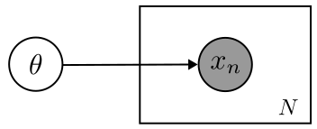
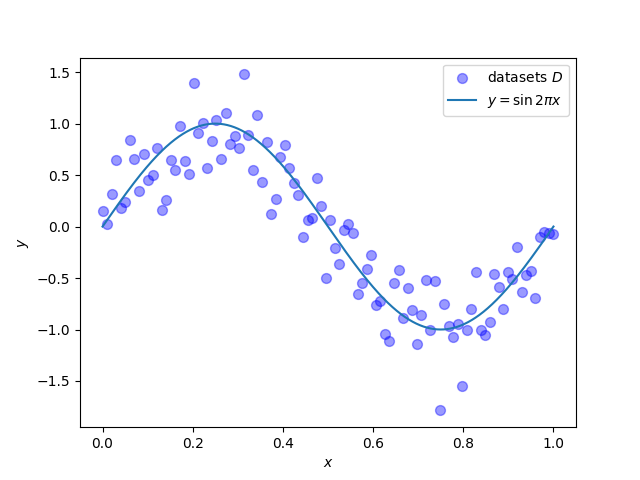
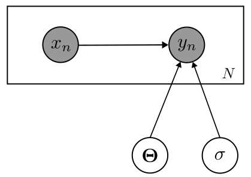
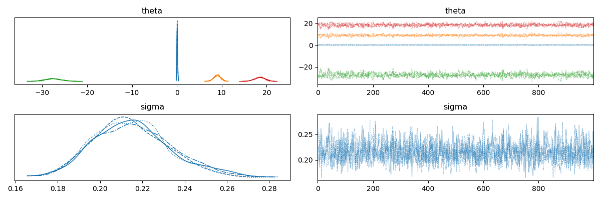
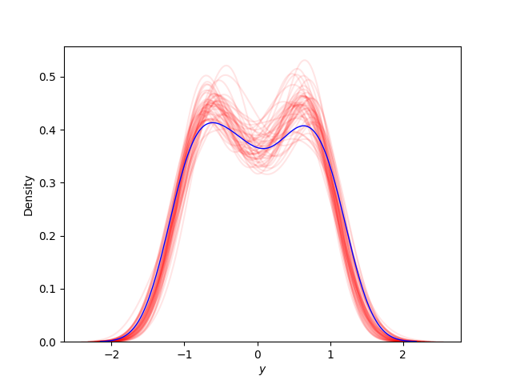
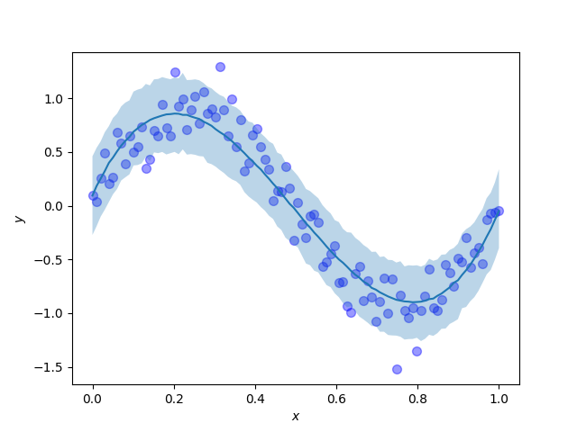

## はじめに
この記事は「[長野高専 Advent Calendar 2022](https://qiita.com/advent-calendar/2022/nnct)」16日目に合わせて書かれた記事です．
おひさしぶりです．やじるしです．Advent Calendar 2022の季節がやってまいりました（この記事を出すのは後半戦）．今回は，機械学習を確率論からアプローチした「ベイズ機械学習」についてまとめたいと思います．自分が理解できるように噛み砕いて書くつもりです．

## 機械学習とはなにか
ベイズ機械学習を始める前に，そもそも機械学習とはなんなのか示さないといけません．
トム・M・ミッチェルの学習の定義を引用します．
>コンピュータプログラムがタスクのクラス$T$と性能指標$P$に関し経験$E$から学習するとは，$T$内のタスクの$P$で測った性能が経験$E$により改善されることを言う．

これを噛み砕くと，何かしらのタスクに対して，手元にあるデータセットから問題に対する性能が上がるように改善を繰り返すアルゴリズムのことを学習と定義しています．タスクに対してモデルを
作り，そのモデルにデータセットを渡して学習を行うことで，モデルは複雑なデータの規則や構造をよりよく表したものになるはずです．そのようなモデルを作り出すことができれば，私達はそのモデルを使用して様々な問題に対する予測や分類，データ生成を行うことができます．

## 確率に関する諸定理
ベイズ機械学習を理解するにあたって，基本的な確率の操作を理解しておく必要があります．
ここでは，確率分布，加法定理・乗法定理，独立性，ベイズの定理を説明します．
### 確率分布
確率を導入するにあたり，はじめに確率分布を定義します．
確率分布はある値に対して，その値がどれだけの確率で現れるかを表したものです．
確率分布を導入することで，不確定性があるようなパラメータなども確率という整えられたフレームワーク内で操作することが可能になります．\
各要素が連続値であるような$M$次元ベクトル$\boldsymbol{x} = (x_1, x_2, \cdots x_M)^\top \in \mathbb{R}^M$(確率変数)に対する関数$p(\boldsymbol{x})$が2つの条件を満たすとき，これを確率密度関数といいます．
$$
p(\boldsymbol{x}) \geq 0 \\\
\int p(\boldsymbol{x}) d\boldsymbol{x} = \int \cdots \int p(x_1, \cdots x_M) dx_1 \cdots dx_M = 1
$$

$\boldsymbol{x}$の要素が離散値の場合，これを確率質量関数といいます．$\boldsymbol{x}$の要素が離散値になったことで積分記号の極限が外れて総和記号になっただけで，確率密度関数と表していることは同じです．
$$
p(\boldsymbol{x}) \geq 0 \\\
\sum_{\boldsymbol{x}} p(\boldsymbol{x}) = \sum_{x_1} \cdots \sum_{x_M} p(x_1, \cdots x_M) = 1
$$

これら，確率密度関数と確率質量関数を合わせて確率分布といいます．
以下の説明から，連続値についてのみ説明します．ただし，離散値の場合も同じものが成り立つので，必要になった場合は適時離散値に置き換えてください．
### 加法定理，乗法定理
確率分布を操作するために必要な性質は2つしかありません．確率の加法定理(1)と乗法定理(2)です．確率分布の全操作は加法定理と乗法定理の組み合わせです．そのため，これさえ理解すれば確率分布を自由に操作できるはずです．
$$
\begin{equation}
p(\boldsymbol{x}) = \int p(\boldsymbol{x}, \boldsymbol{y}) d\boldsymbol{y}
\end{equation}
$$
$$
\begin{equation}
p(\boldsymbol{x}, \boldsymbol{y}) = p(\boldsymbol{x} | \boldsymbol{y})p(\boldsymbol{y}) = p(\boldsymbol{y} | \boldsymbol{x})p(\boldsymbol{x})
\end{equation}
$$

$p(\boldsymbol{x}, \boldsymbol{y})$は同時分布とよばれ，ある$\boldsymbol{x}$と$\boldsymbol{y}$が同時に起こる確率がどれだけかを表した確率分布です．加法定理，乗法定理ともに，同時分布を何かしらして違う分布に変えるという操作になっています．
加法定理は，確率変数$\boldsymbol{y}$に関して，全ての取りうる値を加算していくことで，$\boldsymbol{y}$を削除する操作です．周辺化とも呼ばれ，得られる確率分布$p(\boldsymbol{x})$は周辺分布と呼ばれます．乗法定理では，条件付き確率の定義そのものです．条件付き確率$p(\boldsymbol{x} | \boldsymbol{y})$は条件となる確率変数$\boldsymbol{y}$の元で，確率変数$\boldsymbol{x}$がどれだけ現れるかを表した確率です．

### 独立性
条件付き確率$p(\boldsymbol{x} | \boldsymbol{y})$が出てきましたが，確率変数$\boldsymbol{x}$の値の出方は確率変数$\boldsymbol{y}$に影響しないという場合は多くあります．例えば，サイコロが2つA, Bとあったとき，Aを投げて出た値を観測した後に，Bを投げた時，観測されたBの出目はAに影響するでしょうか．何かしらの細工がない限り影響しないと思います．このような状態であるとき，$p(\boldsymbol{x} | \boldsymbol{y}) = p(\boldsymbol{x})$となり，乗法定理に代入すると，式(3)が得られます．
$$
\begin{equation}
p(\boldsymbol{x}, \boldsymbol{y}) = p(\boldsymbol{x})p(\boldsymbol{y})
\end{equation}
$$
これは嬉しい性質です．それぞれの確率変数間で関係性が無い時，周辺分布（確率）はそれぞれの確率変数の確率分布の積で表せます．このような性質を独立性と呼びます．また，この性質は必要十分条件であり，確率変数$\boldsymbol{x}$と$\boldsymbol{y}$が互いに独立である時，式(3)を満たします．確率変数が$\boldsymbol{x}$と$\boldsymbol{y}$だけでなく，複数個あったときにもこの性質はもちろん成り立ちます．確率変数列$\boldsymbol{X} = (\boldsymbol{x}_1, \cdots, \boldsymbol{x}_N)^\top$があった時，式(4)が成り立ちます．
$$
\begin{equation}
p(\boldsymbol{X}) = p(\boldsymbol{x}_1, \cdots \boldsymbol{x}_N) = 
\prod _{i=1}^{N} p(\boldsymbol{x}_i)
\end{equation}
$$

また，新たに$\boldsymbol{x}$と$\boldsymbol{y}$に対して新たに条件$\boldsymbol{z}$がついた時は式(5)が成り立ちます．これを条件付き独立性と呼びます．この性質も複数個の確率変数があった時にも成り立ちます．
$$
\begin{equation}
p(\boldsymbol{x}, \boldsymbol{y} | \boldsymbol{z}) = p(\boldsymbol{x} | \boldsymbol{z})p(\boldsymbol{y} | \boldsymbol{z})
\end{equation}
$$

複数個ある確率変数$\boldsymbol{x}_1, \cdots \boldsymbol{x}_N$がある一つの確率分布に従うという仮定のもとで，独立性が保証されているとき，これは，独立同分布(independent and identically distribute: i.i.d)であるといいます．
学習データは独立同分布に従うことを仮定して議論を進めていきます．
この仮定があることにより，学習データの同時分布が式(4)により求めることができます．（共分散などで各確率変数間の関係を考える必要がありません）

### ベイズの定理
乗法定理(2)より，二つの確率変数$\boldsymbol{x}$と$\boldsymbol{y}$の間には，次のようなことが成り立つことがわかります．
$$
p(\boldsymbol{x}, \boldsymbol{y}) = p(\boldsymbol{x} | \boldsymbol{y})p(\boldsymbol{y}) = p(\boldsymbol{y} | \boldsymbol{x})p(\boldsymbol{x})
$$

ここで，両辺を$p(\boldsymbol{y})$で割ると式(6)が得られます．
$$
\begin{equation}
    p(\boldsymbol{x} | \boldsymbol{y}) = \frac{p(\boldsymbol{y} | \boldsymbol{x})p(\boldsymbol{x})}{p(\boldsymbol{y})}
\end{equation}
$$

この式が表すものこそが，**ベイズの定理**と呼ばれるものです．
確率の乗法定理を変形しただけのものがなぜこんなにも使われ，「ベイズ統計」，「ベイズ推論」，「ベイズ機械学習」など様々な分野で使われているのでしょうか．これは，ベイズの定理の式(6)の意味を考えるとわかります．原因となる確率変数を$\boldsymbol{x}$とし，結果となる確率変数を$\boldsymbol{y}$とします．右辺にある$p(\boldsymbol{y} | \boldsymbol{x})$は原因となる$\boldsymbol{x}$によって結果$\boldsymbol{y}$が決まるという「原因→結果」の順番になっています．左辺はどうなっているでしょうか，左辺は結果$\boldsymbol{y}$から原因$\boldsymbol{x}$が決まるという「結果→原因」の順番になっていることに気が付きます．ベイズの定理がすごいところは「原因→結果」の確率がわかると，「結果→原因」となる確率を調べることができる点です．確率の乗法定理をただ変形させた定理ですが，視点を変えると結果から原因を調べられてしまうという強力な定理になります．

式中に含まれる確率分布について説明します．$p(\boldsymbol{x})$について，結果$\boldsymbol{y}$を観測する前の原因となりうる事前知識を確率分布として仮定できることから事前分布と呼ばれます．$p(\boldsymbol{x} | \boldsymbol{y})$は結果$\boldsymbol{y}$を観測した後の原因$\boldsymbol{x}$の確率分布となっていることから事後分布と呼ばれます．

## ベイズ機械学習
ベイズ機械学習は，確率モデリングと確率推論を利用した機械学習のアプローチです．

観測データ$\boldsymbol{D}$が観測された状態を考えます．
私達は，観測データを構築したモデルに学習させることで，未知のデータに対しても
予測や分類，もしくは新たにデータを生成させるようなタスクを行うことを目標とします．

### モデルの構築
まずはじめに，学習する確率モデルを考えます．確率モデルを考えるにあたり，観測されたデータ$\boldsymbol{X} = (x_1, x_2, \cdots x_N)^T$がそのようにして得られたのかという生成過程を考えることになります．このように，観測データの生成過程を記述することで，人工的なデータのシミュレーションを行うようにしたモデルを生成モデルと呼びます．生成モデルを構築する際には，確率変数間の依存関係をグラフにより表現したグラフィカルモデルにより記述します．グラフィカルモデルはグラフを用いた表現になるので，視覚的にも分かりやすいです．
ここでは，次のようなグラフィカルモデルを考えます．[1]



パラメータ$\theta$によって観測データ$\boldsymbol{X}$が生成されたという構造になっています．これを用いて，同時分布$p(\boldsymbol{X}, \theta)$を考えます．同時分布$p(\boldsymbol{X}, \theta)$は式(7)で表せます．
$$
\begin{align}
p(\boldsymbol{X}, \theta) &= p(\boldsymbol{X} | \theta)p(\theta) \nonumber\\\
                          &= \left\lbrace\prod _{n=1}^N p(x_n | \theta)\right\rbrace p(\theta)
\end{align}
$$

ここで，$p(x_n | \theta)$はパラメータ$\theta$からデータ$x_n$がどのようにして発生しているかを表す尤度関数です．また，$p(\theta)$は，モデルに含まれるパラメータについての確率分布であり，ベイズの定理でいう事前分布となります．これから，観測データ$\boldsymbol{X}$によって，パラメータ$\theta$の確率分布がどのようになるか，すなわち事後分布$p(\theta | \boldsymbol{X})$を考えることになります．

### パラメータの事後分布
パラメータの事後分布$p(\theta | \boldsymbol{X})$を考えます．ベイズの定理より，
式(8)が言えます．
$$
\begin{align}
p(\theta | \boldsymbol{X}) &= \frac{\left\lbrace\prod _{n=1}^N p(x_n | \theta)\right\rbrace p(\theta)}{p(\boldsymbol{X})} \nonumber\\\
&\propto \left\lbrace\prod _{n=1}^N p(x_n | \theta)\right\rbrace p(\theta)
\end{align}
$$

ベイズ機械学習では，事後分布$p(\theta | \boldsymbol{X})$を求めることこそが学習となります．

ベイズの定理により現れた分母$p(\boldsymbol{X})$は式(9)でかけます．
$$
\begin{equation}
p(\boldsymbol{X}) = \int p(\boldsymbol{X} | \theta)p(\theta) d\theta
\end{equation}
$$
これは，周辺尤度と呼ばれ，ベイズ機械学習により得られたパラメータの確率分布$p(\theta)$のもとで，パラメータ$\theta$により生成されたデータ$\boldsymbol{X}$に関する生成確率$p(\boldsymbol{X} | \theta)$の期待値となっていることから，モデルの性能を調べることができるモデルエビデンスとなっています．

### 学習
パラメータの事後分布$p(\theta | \boldsymbol{X})$を求め，どのような確率分布になっているかを調べることが学習となります．なので，実際にパラメータの事後分布$p(\theta | \boldsymbol{X})$を計算していき，事後分布がどのような分布なのかを求めていきます．しかし，事前分布が共役事前分布の場合や，簡単なモデルを構築した場合は解析的に求めることができますが，そうでないような複雑な事前分布を仮定している，もしくは複雑なモデルを構築している場合は解析的に解けません．そこで，事後分布を解析的にではなく，事後分布を近似する手法を取ります．
確率分布を近似する手法としてMCMC法と変分推論法が挙げられます．

- MCMC法 : マルコフ連鎖モンテカルロ法．サンプリングを応用した近似手法．
- 変分推論法 : 簡単な確率分布を仮定して，それと事後分布を比較することにより近似する手法．

### 予測分布
学習されたパラメータの事後分布から，未知のデータ$x_\star$に対して知見を得たいです．
なので，予測分布$p(x_\star | \boldsymbol{X})$を求めます．確率の加法定理などを使って，式を変形します．
$$
p(x_\star | \boldsymbol{X}) = \int p(x_\star | \theta)p(\theta | \boldsymbol{X}) d\theta
$$

ここで，被積分関数の因数2つに注目します．
$p(x_\star | \theta)$はパラメータ$\theta$から未知データ$x_\star$予測するという識別モデルになっており，$p(\theta | \boldsymbol{X})$は先ほど学習した事後分布になっています．
すなわち，予測分布$p(x_\star | \boldsymbol{X})$は，あらゆるパラメータに関しての加重平均を求めることで，予測の不確かさを表すことができるのです．


## ベイズ機械学習の利点
ベイズ機械学習は確率モデリングと確率推論を利用した手法であることから最尤推定や誤差関数の最適化による機械学習に比べて，次のような利点を持ちます．
- 様々な問題に対して一貫性を持って解くことができる　\
様々な問題に対して，グラフィカルモデルにより生成過程を記述することで確率モデルにすることができます．例えば，次のような問題に対して適用することができます．
    - 線型回帰
    - クラスタリング
    - 次元削減
    - 隠れマルコフモデル など
- 対象の不確実性を定量的に扱うことができる \
ベイズ機械学習により求めた予測分布は確率分布であるので，確率の世界で不確実性を定量的に扱えます．
- 自分が持っている知見を自然に取り入れることができる \
モデリングの時点で，事前分布に自分の持っている知見を取り入れることができます．
- 過学習が起こりにくい

## 確率的プログラミング言語
ベイズ機械学習を行うためには，確率分布の近似アルゴリズム（ベイズ機械学習では学習にあたるアルゴリズム）であるMCMC法や変分推論法を実装する必要があります．しかし，ここで集中して行いたい作業は確率モデルのモデリングです．そこで，確率的プログラミング言語(Probabilistic Programming Language: PPL)を使用して確率モデルのモデリングと推論を行います．確率的プログラミングは確率モデルを指定したときに，このモデルの推論を自動的に実行してくれるプログラミングパラダイムです．このパラダイムでは，推論を自動的に行ってくれるので，私達は確率モデルのモデリングにだけ集中できます．確率プログラミング言語とは言われていますが，そのためだけの言語として作られることは少なく，Python，C++などの高級言語の拡張として作られていることが多いです．

Pythonでは確率的プログラミング言語はパッケージとして提供されており，次のものが挙げられます．
- [PyStan](https://mc-stan.org/users/interfaces/pystan) : PythonでStanを使うパッケージ
- [PyMC3](https://docs.pymc.io/en/v3/index.html) : TheanoがバックエンドのPPL
- [TensorFlow Probability](https://www.tensorflow.org/probability) : Google製深層学習フレームワークTensorFlowをバックエンドとしたPPL
- [Pyro](https://pyro.ai/) : Uberが開発したPyTorchバックエンドのPPL．変分推論が強いイメージ．
- [NumPyro](https://num.pyro.ai/en/stable/) : PyroのJAX(Numpyに自動微分機能などをつけたGoogle製の線形代数ライブラリ)バックエンド版．MCMC法が速くなった．
- [Pixyz](https://github.com/masa-su/pixyz) : 東京大学 松尾研究室の鈴木雅大さんが中心となって開発した深層生成モデルを作成するためのPyTorchバックエンドのパッケージ．ELBOなどを求めてloss関数を実装するのは自分で行うが，その数式そのものをプログラムで実装できる，ニューラルネットワークを自然に取り込めることが特徴．


## 線形回帰
では，実際に確率的プログラミング言語を使用してベイズ機械学習を行います．
今回は線形回帰を行ってみたいと思います．確率的プログラミング言語はNumPyroを使ってみます．
### 問題設定
問題設定を確認しましょう．
> $\boldsymbol{X} = (x_1, x_2, \cdots, x_N)^\top$とそれに対する目標値$\boldsymbol{Y} = (y_1, y_2, \cdots, y_N)^\top$に基づいて，新たな入力値$x$に関する目標変数$y$の予測を行う．

今回はテストデータセット$\boldsymbol{D} = \lbrace \boldsymbol{X}, \boldsymbol{Y}\rbrace$は次の関係を満たすようなものとします．（本来はここは分かっていません）
$$
y = \sin{(2\pi x)} + \varepsilon \\\
\epsilon \sim \mathcal{N}(0, 0.2)
$$

実際にグラフにプロットしてみます．0から1の範囲で50点だけデータを取ると，グラフは以下の図のようになりました．理想的には$y = \sin{(2\pi x)}$になっていてほしいです．



データセットは次のソースコードで作成しました．乱数のシード値は固定しています．
```python
N = 100
X = jnp.linspace(0, 1, N)
Y = jnp.sin(2 * jnp.pi * X) + np.random.normal(0, 0.2, (N, ))
```

### モデルの構築
学習する確率モデルを構築しましょう．
観測された入力データ$\boldsymbol{X}$，出力データ$\boldsymbol{Y}$，
未知のパラメータ$\boldsymbol{\Theta} = (\theta_1, \theta_2, \cdots \theta_M)^\top$
の関係は次のようなグラフィカルモデルで仮定します．



このグラフィカルモデルから同時分布を求めます．
$$
\begin{align}
p(\boldsymbol{X}, \boldsymbol{Y}, \boldsymbol{\Theta}, \sigma) &= p(\boldsymbol{\Theta})p(\sigma)p(\boldsymbol{Y} | \boldsymbol{X}, \boldsymbol{\Theta}, \sigma)p(\boldsymbol{X})\nonumber\\\
&= p(\boldsymbol{\Theta})p(\sigma)\prod _{n=1}^N p(y_n | x_n, \boldsymbol{\Theta}, \sigma)p(x_n) \nonumber
\end{align}
$$

識別モデル$p(y_n | x_n, \boldsymbol{\Theta}, \sigma)$について考えましょう．
識別モデルには線型回帰を仮定するので，次のような式になります．
パラメータ$\boldsymbol{\Theta}$は$\boldsymbol{\Theta} = (\theta_0, \theta_1 \cdots \theta_M) \in \mathbb{R}^{M+1}$とします．

$$
y_n = \theta_0 + \theta_1 x_n + \theta_2 x_n^2 + \cdots + \theta_M x_n^M + \varepsilon
$$

ここで，$\varepsilon$は不確実性を表す誤差で，次の正規分布に従うものとします．
$$
\varepsilon \sim \mathcal{N}(0, \sigma)
$$

この二つを合わせると，識別モデル$p(y_n | x_n, \boldsymbol{\Theta}, \sigma)$は次の式で表すことができます．

$$
p(y_n | x_n, \boldsymbol{\Theta}) = \mathcal{N}(\theta_0 + \theta_1 x_n + \theta_2 x_n^2 + \cdots + \theta_M x_n^M, \sigma)
$$

パラメータの事前分布$p(\boldsymbol{\Theta})$，$p(\sigma)$を仮定します．
パラメータの事前分布$p(\boldsymbol{\Theta})$は平均$\boldsymbol{0}$，共分散行列$20I$である多次元正規分布を仮定します．[2]
$$
p(\boldsymbol{\Theta}) = \mathcal{N}(\boldsymbol{0}, 20I)
$$

精度パラメータ$\sigma$に関しても事前分布を導入します．$0$から$1.0$までの一様分布と仮定します．
$$
p(\sigma) = U(0, 1.0)
$$

識別モデル，事前分布の仮定を含めると，同時分布$p(\boldsymbol{X}, \boldsymbol{Y}, \boldsymbol{\Theta})$は
次のように表せます．
$$
p(\boldsymbol{X}, \boldsymbol{Y}, \boldsymbol{\Theta}, \sigma) = \mathcal{N}(\boldsymbol{0}, 20I)U(0, 1.0)\prod _{n=1}^N\mathcal{N}(\theta_0 + \theta_1 x_n + \theta_2 x_n^2 + \cdots \theta_M x_n^M, \sigma)p(x_n)
$$

NumPyroでモデリングしてみましょう．行列計算に注意しながら実装していきます．
ここでは，$M = 3$として3次関数により近似することを考えます．
```python
M = 3
def model(X, Y=None):
    theta = numpyro.sample("theta", dist.MultivariateNormal(0, 20 * jnp.eye(M + 1)))
    sigma = numpyro.sample("sigma", dist.Uniform(0.0, 1.0))

    x_list = jnp.array([jnp.power(X, i) for i in range(0, M + 1)]).squeeze().T
    mu = numpyro.deterministic("mu", jnp.dot(x_list, theta.T))

    y_pred = numpyro.sample("y", dist.Normal(mu, sigma), obs=Y)
```


### パラメータの事後分布
同時分布$p(\boldsymbol{X}, \boldsymbol{Y}, \boldsymbol{\Theta})$が分かったので，
ここからパラメータの事後分布を考えていきます．
$$
p(\boldsymbol{\Theta} | \boldsymbol{X}, \boldsymbol{Y}, \sigma) \propto  p(\boldsymbol{\Theta})p(\sigma)\prod _{n=1}^N p(y_n | x_n, \boldsymbol{\Theta})p(x_n) 
$$

分母のモデルエビデンスは学習時には定数として扱うことができるので無視します．
この事後分布を解析的，もしくは確率分布の近似計算を行うことによって求めます．

先ほどNumPyroにより実装したモデルを学習しましょう．今回は，MCMC法を用います．
```python
kernel = numpyro.infer.NUTS(model)
mcmc = numpyro.infer.MCMC(kernel, num_samples=1000, num_warmup=300, num_chains=4, chain_method="parallel")
mcmc.run(jax.random.PRNGKey(0), X, Y)
```

MCMC法の場合，トレースプロットというものがあります．MCMC法を用いてサンプリングを行った後，トレースプロットの収束を見ることで，近似した分布が妥当かどうかを調べることができます．パラメータ`theta`と`sigma`のトレースプロットを見てみましょう．
```python
az.plot_trace(mcmc, var_names=["theta", "sigma"])
```
トレースプロットの結果を次に示します．



それぞれのパラメータに対するトレースプロットは，"毛虫"のように収束していることがわかります．事後分布についても一定に収束していることがわかります．

### 予測分布
予測分布も考えましょう．学習された$\boldsymbol{\Theta}$の分布$p(\boldsymbol{\Theta} | \boldsymbol{X}, \boldsymbol{Y})$を使って新しい入力値$x_\star$に対応する
未知の出力値$y_\star$に関する予測分布$p(y_\star | x_\star \boldsymbol{X}, \boldsymbol{Y})$を求めます．
$$
p(y_\star | x_\star, \boldsymbol{X}, \boldsymbol{Y}) = \int p(y_\star | x_\star, \boldsymbol{\Theta}, \sigma)p(\Theta | \boldsymbol{X}, \boldsymbol{Y})p(\sigma | \boldsymbol{X}, \boldsymbol{Y}) d\boldsymbol{\Theta}
$$

NumPyroで予測分布を求めます．先ほどMCMC法により，各パラメータの事後分布を求めたので予測分布を求めることができます．
```python
x_ = jnp.linspace(0, 1, 100).reshape(-1, 1)
posterior_samples = mcmc.get_samples()
posterior_predictive = numpyro.infer.Predictive(model, posterior_samples, return_sites=["y"])
predict = posterior_predictive(jax.random.PRNGKey(1), x_)
```
求めた予測分布の標本から，カーネル密度推定(kdernel density estimation)を行ってみます．
カーネル密度推定は未知の確率密度関数を持つi.i.dから得られた標本から，確率変数の確率密度関数を推定する手法です．真の観測データ$y$と予測分布の標本$y_{pos}$のいくつかでカーネル密度推定を行い，真の観測データの推定した確率密度関数と予測分布の標本で推定した確率密度関数が近ければ，予測分布は妥当な推定ができると言えます．カーネル密度推定の結果を以下の図に示します．青色が真の観測データで推定した確率密度関数であり，赤色が予測分布の標本で推定した確率密度関数です．プロットを見ると，真の観測データと予測分布の標本によって推定された確率密度関数がある程度近いことがわかるので，学習して求めた予測分布は妥当な推論ができると言えます．



では，$xy$平面に予測分布をプロットして，どれだけ予測がうまくできているかを見てみます．
$xy$平面に予測分布を90%信頼区間でプロットします．予測結果をわかりやすくするために，データセットもプロットします．濃い青の曲線は予測分布の期待値で，薄い青色で塗られている部分が予測分布の90%信頼区間です．



この予測分布を見ると，期待値は観測データを作る際に用いた生成過程である$y = \sin{(2\pi x)}$に近く，また，確率分布を導入したことによって，点推定ではなく不確実性も考慮した予測できていることがわかります．すごい．

## 終わりに
この記事を書くことを通して，自分が勉強していて曖昧になっていたことが明確に理解できるようになったことが多くありました．やはり，勉強したことをアウトプットしてみることは大事なことなのだと改めて思いました．今回の記事では，実装についても扱いました．わからないことを色々調べたり，何度もテストをしてみたりしながらモデルを作っていったので，理論と実装を絡めながら理解することができたのでよかったです．

実はこの記事は前置きです．19日にもAdvent Calendarに記事を出します．今度はここで書いた知識を応用して音声合成の観点からみた隠れマルコフモデルを理解する予定です．書き終わるかわかりませんがよろしくお願いします．

## 参考文献
- 須山敦司著，杉山将監修，『ベイズ推論による機械学習入門』
- C.M.ビショップ，『パターン認識と機械学習 ベイズ推論による統計的予測』
- 河原創，『機械学習で楽しむJAX/NumPyro v0.1.2』

> [1] グラフィカルモデルにおいて，円で書かれている変数が確率変数です．特に黒色の円は観測された確率変数であることを表します．四角形はプレートと呼ばれ，プレートの中にあるモデルが独立同分布に従った状態で複数個あることを表します． \
> [2] 共分散行列$\boldsymbol{\Sigma} = \sigma I$は対角成分が$\sigma$，それ以外が0の行列となっているため，変量間は互いに独立です．
> 
