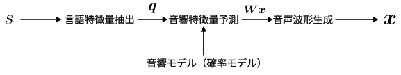
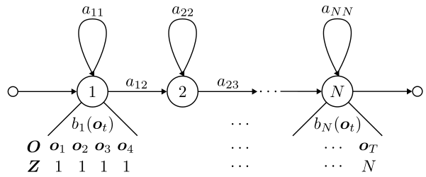
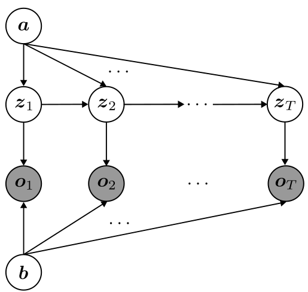
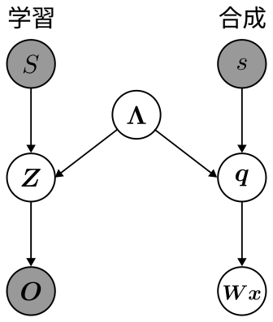

## はじめに
この記事は，「[長野高専 Advent Calendar 2022](https://qiita.com/advent-calendar/2022/nnct)」19日目に合わせて書かれた記事です．
16日目にも記事を書いたやじるしです．16日目の記事の最後に19日目にも記事を書くと言いました．書きました．僕は音声合成がユーザー側の視点で好きです．好きだとどうなるのか．作ってみたくなります．ということで，前回に書いたベイズ機械学習の知見を使って，統計的音声合成とくに隠れマルコフモデルによる音声合成について仕組みを自分自身で噛み砕きながら理解していきたいと思います．
`
## 音声合成とは
そもそも，音声合成とはどのようなものなのでしょうか．
Wikipediaの音声合成を引用します．
> ヒトは発声器官を通じて音声を生成し、コミュニケーションを行なう（会話や演説、講演、各種芸能およびその中継や録音・録画など）。この音声を人工的に生成するタスクが音声合成である。合成された音声を合成音声と呼ぶ。

音声合成は，このコミュニケーションをとるためのインターフェースである音声を機械（コンピュータ）によって人工的に再現しようという試みです．
音声合成によって得られた合成音声は今の社会で様々な場所で使われています．
今もしかしたら聞いているかもしれないボカロ曲は，歌声音声合成エンジンによって合成された歌声，実況動画や解説動画で聞こえてくる声も合成音声かもしれません．このようなエンターテイメントによる利用だけでなく，例えば，電車に乗っている間に聞こえてくる乗換情報のアナウンス，災害情報を瞬時に伝える全国瞬時警報システム（Jアラート），自分のスマートフォンの中にいるアシスタントなども合成された音声によって私達の耳に届いて，大切な情報を正確に伝えてくれています．合成音声は遠い存在ではなく，私達の生活の中に溶け込んでいる身近な存在なのです．さらに，コンピュータと音声を通してコミュニケーションを取る，医療現場などに応用するなど，他の技術と組み合わせることで，有用なシステムを作り出すことができます．今回はこのような面白い技術について，特に仕組みに注目して書いていきます．

## 音声合成の手法について
音声合成を行う手法としては，これまでの研究から様々なものが考案されており，
大きく分けて，「規則合成方式」，「素片選択型方式」，「統計的パラメトリック音声合成方式」，「一貫学習方式」
が挙げられます．
- 規則合成方式 : 韻律やフォルマントの規則を記述する方式．足立レイはフォルマント合成なのでこの方式に入るはず．
- 素片選択型方式 : 音声素片（音素）を接続することで音声を合成する方式．UTAU，VOCALOID[1]，VOICEROIDなど．
- 統計的パラメトリック音声合成 : 生成モデルによってテキストから音声への生成過程を記述し合成する方式．CeVIO，Open JTalk，Sinsy，A.I.VOICE[2]，Synthesizer Vなど．
- 一貫学習方式 : 音声特徴量，言語特徴量の解析による前処理，音響モデルによる推定，合成を一貫して一つのモデルで行う方式．Tacotronなど．

挙げた例の中には，複数の方式を使って音声を合成するハイブリッドな方式を用いているものもあります．

## 統計的パラメトリック音声合成
統計的パラメトリック音声合成は，音声とテキストの関係が何かしらの確率分布に従っているという仮定のもとで，生成モデルによってそれを記述する手法です．生成モデルは，生成過程を考えることでモデリングされた同時分布によるモデルで，識別モデルのような条件付き確率分布と違い，確率モデルからサンプリングすることで特徴量の生成を行うことができます．

では，統計的パラメトリック音声合成はどのように音声合成を行うのでしょうか．
最終的な目標は，与えられたテキストから何かしらの処理をして音声を生成することです．
音声の合成の流れを次の図に示します．はじめに，テキスト$s$から言語特徴量を取り出します．この言語特徴量から，確率モデルで記述された音響モデルに入れることにより，このテキストに沿った音声特徴量$\boldsymbol{Wx}$を得ることができます．この得られた音声特徴量をボコーダによって合成することにより波形が生成され，合成された音声が得られます．

生成モデルとして記述するのは，音響特徴量を予測する音響モデルの部分です．音響モデルはテキストから得られる言語特徴量から，音声波形の生成に必要な音声特徴量を計算する，合成音声の品質に大きく影響するモジュールとなります．音響モデルには，大きく隠れマルコフモデル(HMM)によるモデルと深層ニューラルネットワーク(DNN)によるモデルが挙げられます．
- HMM音声合成
    - 少ないデータで構築可能．声色を柔軟に制御可能．サイズが小さい．
    - 状態系列（音素アラインメント）も同時に学習される．
    - 素片選択型より品質が劣化する．
- DNN音声合成
    - 言語と音声の複雑な関係を高制度にモデル化可能なので，高品質な音声が得られる．
    - 言語特徴量と音声特徴量の系列が異なるため，モデルによっては継続帳予測，音声特徴量予測を行う2つのモデルを作る必要がある．

HMM音声合成，DNN音声合成どちらも利点と弱点があることがわかります．
どちらの手法も，音響モデルをモデリングして，言語特徴量から音響特徴量を得るという根本的な考え方は同じです．そのため，どちらかの手法について仕組みを理解すれば，もう一つの手法はただモデルを置き換えただけと考えることができると思います．

今回は，隠れマルコフモデル(HMM)による音声合成について，どのようにモデリングして学習を行うのかをベイズ的アプローチに基づいて行っているものを調べてみます．論文は「ベイズ的アプローチに基づくHMM音声合成」を参考にし，隠れマルコフモデルのモデリングと変分推論で用いる変分下限の計算までの部分について，実際に式の展開やグラフィカルモデルを用いながら理解していきたいと思います．言語特徴量の抽出部と，音声波形の生成を行うボコーダのことは今回は書いていません．（ボコーダにも，WORLDにような古典的なアルゴリズムを複数用いたものや，WaveNetのような深層学習を応用したものまで様々な手法があります．たしかに，音響特徴量から波形を生成するところでも音声の精度は変わりそうです．）

## 問題設定
隠れマルコフモデルを用いた音声合成について，問題を定めて見通しを立てます．
隠れマルコフモデルによる音響モデルからは，動的特徴量を含む音声パラメータ$\boldsymbol{Wx}$を合成したいです．ここで，$\boldsymbol{x}$が音声パラメータの静的特徴量であり，以下の式で書けます．
$$
\boldsymbol{x} = (\boldsymbol{x}_1^\top, \boldsymbol{x}_2^\top, \cdots, \boldsymbol{x} _{T_x}^\top)^\top
$$

$\boldsymbol{W}$は，静的特徴量から動的特徴量に変換する行列であり，$\boldsymbol{x}_t$から動的特徴量に変換した行列$(\boldsymbol{Wx})_t$は次の式で書けます
$$
(\boldsymbol{Wx})_t = (\boldsymbol{x}_t^\top, \Delta\boldsymbol{x}_t^\top, \Delta^2\boldsymbol{x}_t^\top)^\top
$$

動的特徴量は静的特徴量の変化である一階微分，二階微分を表した量であり，これを音声特徴量に導入することで，状態遷移部やモデル接続部で歪みの少ないなめらかな音声を生成できるようです．

## モデル構築
はじめに，音声合成を行う隠れマルコフモデルを定義します．
音声特徴量の観測ベクトル列$\boldsymbol{O}$を$\boldsymbol{O} = (\boldsymbol{o}_1, \boldsymbol{o}_2, \cdots, \boldsymbol{o}_T)$，状態遷移を表す隠れ変数列(状態系列)$\boldsymbol{Z}$を$\boldsymbol{Z} = (z_1, z_2, \cdots, z_T), z_t \in \lbrace1, \cdots N\rbrace$とします．ただし，$T$は出力する音声のサンプリング数，$N$は隠れマルコフモデルの状態数を表します．グラフィカルモデルを図に示します．

ここで，議論を行いやすくするために$z_t^i$を式(1)で定義します．
$$
\begin{equation}
    z_t^i = 
    \begin{cases}
    1 \ (z_t = i) \\\
    0 \ (\text{otherwise})
    \end{cases}
\end{equation}
$$

隠れマルコフモデルが持つパラメータ$\boldsymbol{\Lambda} = \lbrace \boldsymbol{a}, \boldsymbol{b}\rbrace$について確認します．
$\boldsymbol{a}$は遷移行列であり，各要素$a_{ij}$が次の式を満たすものとします．
状態が$i$から$j$へ遷移するときの確率です．
$$
a_{ij} = p(z_{t+1} = j | z_{t} = i)
$$

これを集めて$N\times N$の行列にすると遷移行列となります．
行ごとに見ると，$i$番目の行が状態$i$からの遷移確率を表したベクトルになっていることがわかります．
$$
\boldsymbol{a} = \begin{bmatrix}
a_{11} &\cdots &a_{1N} \\\
\vdots &\ddots &\vdots \\\
a_{N1} &\cdots &a_{NN}
\end{bmatrix}
$$

$\boldsymbol{b}$はある状態における音声特徴量の出力確率ベクトルです．各要素$b_i(\boldsymbol{o}_t)$が次の式を満たします．出力確率ベクトルの各要素確率分布は多変量正規分布であると仮定します．ここで，$\boldsymbol{\mu}_i$は多変量正規分布の平均で，$\boldsymbol{s}_i$は共分散行列の逆数である精度パラメータです．
$$
\begin{align}
b_i(\boldsymbol{o}_t) &= p(\boldsymbol{o}_t | z_t = i) \\\
    &= \mathcal{N}(\boldsymbol{o}_t | z_t = i, \boldsymbol{\mu}_i, \boldsymbol{s}_i^{-1})
\end{align}
$$

各要素を集めると，$1\times N$の出力確率ベクトルとなります．
$$
\boldsymbol{b} = (b_1(\boldsymbol{o}_t), b_2(\boldsymbol{o}_t), \cdots, b_N(\boldsymbol{o}_t))
$$

パラメータについては終わりなので，隠れマルコフモデルのモデリングを行っていきます．
上で示したグラフィカルモデルでもいいのですが，再帰的な部分を含んでいるため，この部分を展開したようなグラフを描いて，モデリングしやすくします．このとき，パラメータも確率変数として扱って，グラフィカルモデル上に記述してしまいます．

では，このグラフィカルモデルから同時分布$p(\boldsymbol{O}, \boldsymbol{Z}, \boldsymbol{\Lambda})$を求めます．式(4)のようになります．
$$
\begin{align}
p(\boldsymbol{O}, \boldsymbol{Z}, \boldsymbol{\Lambda}) 
& = p(\boldsymbol{\Lambda})p(\boldsymbol{O} | \boldsymbol{Z}, \boldsymbol{\Lambda})\prod _{t=1}^{T-1}
p(z _{t+1} | z_t, \boldsymbol{\Lambda}) \nonumber \\\
& = p(\boldsymbol{a})p(\boldsymbol{b})p(\boldsymbol{O} | \boldsymbol{Z}, \boldsymbol{b})\prod _{t=1}^{T-1}p(z _{t+1} | z_t, \boldsymbol{a})
\end{align}
$$

式(4)の右辺に含まれる因数についてそれぞれ考えていきます． \
$p(\boldsymbol{O} | \boldsymbol{Z}, \boldsymbol{b})$について，観測データはi.i.dに従っていることを仮定していることから，式(5)が成り立ちます．
$$
\begin{equation}
p(\boldsymbol{O} | \boldsymbol{Z}, \boldsymbol{b}) = \prod _{t = 1}^T p(\boldsymbol{o}_t | z_t, \boldsymbol{b})
\end{equation}
$$
ここで，$p(\boldsymbol{o}_t | z_t, \boldsymbol{b})$について考えます．
よく考えると，この確率は出力確率そのものを表していることに気が付きます．式(1)，パラメータの確率分布の仮定を用いると，この確率分布は式(6)で書けます．この式では$t$と$i$が一致したときの出力確率を返すようにしています．
$$
\begin{align}
p(\boldsymbol{o}_t | z_t, \boldsymbol{b}) &= \prod _{i=1}^N b_i(\boldsymbol{o}_t)^{z_t^i} \nonumber \\\
& = \prod _{i=1}^N \mathcal{N}(\boldsymbol{o}_t | \boldsymbol{\mu}_i, \boldsymbol{s}_i^{-1})^{z_t^i}
\end{align}
$$

式(5)と式(6)をまとめると，式(7)が得られます．
$$
\begin{equation}
p(\boldsymbol{O} | \boldsymbol{Z}, \boldsymbol{b}) = \prod _{t=1}^T \prod _{i=1}^N \mathcal{N}(\boldsymbol{o}_t | \boldsymbol{\mu}_i, \boldsymbol{s}_i^{-1})^{z_t^i}
\end{equation}
$$

$p(z _{t+1} | z_t, \boldsymbol{a})$について考えます．
$t$と$i$が一致したときに，$z _{t+1}$に遷移する遷移確率を知りたいので，
カテゴリ分布を用いることで確率分布を記述することができます．この確率分布は式(8)で書けます．

$$
\begin{align}
p(z _{t+1} | z_t, \boldsymbol{a}) &= \prod _{i=1}^N \text{Cat}(z _{t+1}, \boldsymbol{a} _{i, :})^{z_t^i} \nonumber \\\
&= \prod _{i=1}^N \prod _{j=1}^N a _{ij}^{z _{t+1}^i \cdot z_t^i}
\end{align}
$$

各因数の確率分布が分かったので，同時分布である式(4)に式(7)と式(8)を代入します．
$$
\begin{align}
p(\boldsymbol{O}, \boldsymbol{Z}, \boldsymbol{\Lambda})
&= p(\boldsymbol{a})p(\boldsymbol{b})p(\boldsymbol{O} | \boldsymbol{Z}, \boldsymbol{b})\prod _{t = 1}^{T-1} p(z _{t+1} | z_t, \boldsymbol{a}) \nonumber \\\
&= p(\boldsymbol{a})p(\boldsymbol{b})\prod _{t=1}^T \prod _{i=1}^N \mathcal{N}(\boldsymbol{o}_t | \boldsymbol{\mu}_i, \boldsymbol{s}_i^{-1})^{z_t^i}
\prod _{t=1}^{T-1}
\prod _{i=1}^N \prod _{j=1}^N a _{ij}^{z _{t+1}^i \cdot z_t^i}
\end{align}
$$

よって，$\boldsymbol{\Lambda}$から出力される$\boldsymbol{O}$，$\boldsymbol{Z}$の確率分布は式(10)で表せます．
$$
\begin{equation}
p(\boldsymbol{O}, \boldsymbol{Z} | \boldsymbol{\Lambda})
= \prod _{t=1}^T \prod _{i=1}^N \mathcal{N}(\boldsymbol{o}_t | \boldsymbol{\mu}_i, \boldsymbol{s}_i^{-1})^{z_t^i}
\prod _{t=1}^{T-1}
\prod _{i=1}^N \prod _{j=1}^N a _{ij}^{z _{t+1}^i \cdot z_t^i}
\end{equation}
$$

計算を簡単にするため，対数尤度に変換します．これで，隠れマルコフモデルのモデリングができました．
$$
\begin{equation}
\ln p(\boldsymbol{O}, \boldsymbol{Z} | \lambda)
= \sum _{t=1}^T \sum _{i=1}^N \ln\mathcal{N}(\boldsymbol{o}_t | \boldsymbol{\mu}_i, \boldsymbol{s}_i^{-1})^{z_t^i} + \sum _{t=1}^{T-1}\sum _{i=1}^N \sum _{j=1}^N z_t^i z _{t+1}^i \ln a _{ij}
\end{equation}
$$

## 予測分布
事後分布の近似後は予測分布を求めることで，音声パラメータ$\boldsymbol{Wx}$の生成を行えるようにします．ベイズ基準による音声合成は次式で与えられます．ここで，$\boldsymbol{Wx}$は予測した音声特徴量，$\boldsymbol{O}$は学習する音声特徴量，$s$は予測時(音声合成時)のラベル列，$S$は学習時のラベル列を表します．（下の式変形は音声特徴量$\boldsymbol{Wx}$，$\boldsymbol{O}$はラベル列$s$，$S$によって決まるからできるのだろうか？）
$$
\begin{align}
    \boldsymbol{x}^{(Bayes)} &= \argmax _{\boldsymbol{x}} p(\boldsymbol{Wx} | s, \boldsymbol{O}, S) \nonumber\\\
    &= \argmax _{\boldsymbol{x}}p(\boldsymbol{Wx}, \boldsymbol{O} | s, S)
\end{align}
$$

式(12)の確率分布$p(\boldsymbol{Wx}, \boldsymbol{O} | s, S)$は，ラベル列すなわち合成したいテキストから音声を生成する分布になっています．この分布は，学習データと合成したデータの二つを組み合わせた分布になっているので，これを学習データの分布と合成の分布の二つに分けたいです．そこで，確率の加法定理を利用して，学習の状態系列$\boldsymbol{Z}$，合成の状態系列$\boldsymbol{q}$，隠れマルコフモデルのパラメータ$\boldsymbol{\Lambda}$を導入します．
$$
\begin{equation}
    p(\boldsymbol{Wx}, \boldsymbol{O} | s, S) 
    =\sum _{\boldsymbol{q}} \sum _{\boldsymbol{Z}} \int p(\boldsymbol{Wx}, \boldsymbol{O}, \boldsymbol{q}, \boldsymbol{Z}, \boldsymbol{\Lambda} | s, S) d\boldsymbol{\Lambda}
\end{equation}
$$

被積分関数となっている確率分布$p(\boldsymbol{Wx}, \boldsymbol{O}, \boldsymbol{q}, \boldsymbol{Z}, \boldsymbol{\Lambda} | s, S)$について考えましょう．条件付き確率であるので，次の式が成り立ちます．
$$
\begin{equation}
p(\boldsymbol{Wx}, \boldsymbol{O}, \boldsymbol{q}, \boldsymbol{Z}, \boldsymbol{\Lambda} | s, S) = \frac{p(\boldsymbol{Wx}, \boldsymbol{O}, \boldsymbol{q}, \boldsymbol{Z}, \boldsymbol{\Lambda}, s, S)}{p(s, S)}
\end{equation}
$$
同時分布をグラフィカルモデルによってモデリングします．
次のようなグラフィカルモデルになると思います．学習と合成がそれぞれ独立な操作になっているので，確率変数自体も独立になっており，隠れマルコフモデルのパラメータ$\boldsymbol{\Lambda}$によってつながっているような状態になります．

このグラフィカルモデルから，同時分布を確率分布の積に変形します．
$$
\begin{align}
p(\boldsymbol{Wx}, \boldsymbol{O}, \boldsymbol{q}, \boldsymbol{Z}, \boldsymbol{\Lambda}, s, S) &= p(\boldsymbol{Wx} | \boldsymbol{q})p(\boldsymbol{q} | s, \boldsymbol{\Lambda})p(\boldsymbol{O} | \boldsymbol{Z})p(\boldsymbol{Z} | S, \boldsymbol{\Lambda})p(\boldsymbol{\Lambda})p(s)p(S) \nonumber\\\
&= p(\boldsymbol{Wx}, \boldsymbol{q} | s, \boldsymbol{\Lambda})p(\boldsymbol{O}, \boldsymbol{Z} | S, \boldsymbol{\Lambda})p(\boldsymbol{\Lambda})p(s)p(S)
\end{align}
$$

よって，求めたかった被積分関数である確率分布$p(\boldsymbol{Wx}, \boldsymbol{O}, \boldsymbol{q}, \boldsymbol{Z}, \boldsymbol{\Lambda} | s, S)$は，式(16)と求まります．
$$
\begin{equation}
p(\boldsymbol{Wx}, \boldsymbol{O}, \boldsymbol{q}, \boldsymbol{Z}, \boldsymbol{\Lambda} | s, S) = p(\boldsymbol{Wx}, \boldsymbol{q} | s, \boldsymbol{\Lambda})p(\boldsymbol{O}, \boldsymbol{Z} | S, \boldsymbol{\Lambda})p(\boldsymbol{\Lambda})
\end{equation}
$$

式(13)に式(16)を代入します．これにより，合成の尤度と学習の尤度に分けることができました．この式が今回求めたい予測分布となります．
$$
\begin{align}
p(\boldsymbol{Wx}, \boldsymbol{O} | s, S) 
    &=\sum _{\boldsymbol{q}} \sum _{\boldsymbol{Z}} \int p(\boldsymbol{Wx}, \boldsymbol{O}, \boldsymbol{q}, \boldsymbol{Z}, \boldsymbol{\Lambda} | s, S) d\boldsymbol{\Lambda} \nonumber \\\
    &= \sum _{\boldsymbol{q}} \sum _{\boldsymbol{Z}} \int p(\boldsymbol{Wx}, \boldsymbol{q} | s, \boldsymbol{\Lambda})p(\boldsymbol{O}, \boldsymbol{Z} | S, \boldsymbol{\Lambda})p(\boldsymbol{\Lambda}) d\boldsymbol{\Lambda}
\end{align}
$$

## 変分推論(変分下限の導出)
変分推論を行って，事後分布の近似を求めます．
確率分布$p(\boldsymbol{Wx}, \boldsymbol{O} | s, S)$に対して対数を取って対数尤度に変形して計算を行います．ここで，任意の分布$Q(\boldsymbol{q}, \boldsymbol{Z}, \boldsymbol{\Lambda})$を導入します．目標は，複雑な状態系列と隠れマルコフモデルのパラメータによる分布を簡単な分布$Q$で近似することです．途中の式変形ではイェンセンの不等式を用いました．
$$
\begin{align}
\log p(\boldsymbol{Wx}, \boldsymbol{O} | s, S) 
&= \log \sum _{\boldsymbol{q}}\sum _{\boldsymbol{Z}}\int p(\boldsymbol{Wx}, \boldsymbol{O}, \boldsymbol{q}, \boldsymbol{Z}, \boldsymbol{\Lambda} | s, S) d\boldsymbol{\Lambda} \nonumber \\\
&= \log \sum _{\boldsymbol{q}}\sum _{\boldsymbol{Z}}\int Q(\boldsymbol{q}, \boldsymbol{Z}, \boldsymbol{\Lambda})\frac{p(\boldsymbol{Wx}, \boldsymbol{O}, \boldsymbol{q}, \boldsymbol{Z}, \boldsymbol{\Lambda} | s, S)}{Q(\boldsymbol{q}, \boldsymbol{Z}, \boldsymbol{\Lambda})} d\boldsymbol{\Lambda} \nonumber\\\
&\geq \sum _{\boldsymbol{q}}\sum _{\boldsymbol{Z}}\int Q(\boldsymbol{q}, \boldsymbol{Z}, \boldsymbol{\Lambda})\log \frac{p(\boldsymbol{Wx}, \boldsymbol{O}, \boldsymbol{q}, \boldsymbol{Z}, \boldsymbol{\Lambda} | s, S)}{Q(\boldsymbol{q}, \boldsymbol{Z}, \boldsymbol{\Lambda})} d\boldsymbol{\Lambda} \nonumber \\\
&=\left< \log \frac{p(\boldsymbol{Wx}, \boldsymbol{O}, \boldsymbol{q}, \boldsymbol{Z}, \boldsymbol{\Lambda} | s, S)}{Q(\boldsymbol{q}, \boldsymbol{Z}, \boldsymbol{\Lambda})}\right> _{Q(\boldsymbol{q}, \boldsymbol{Z}, \boldsymbol{\Lambda})} = \mathcal{F}
\end{align}
$$

$\mathcal{F}$という記号がでてきました．これは$Q(\boldsymbol{q}, \boldsymbol{Z}, \boldsymbol{\Lambda})$に対する変分下限（vasriational lower bound: VLB)もしくはELBO(evidence lower bound)と呼ばれるものです．周辺尤度$p(\boldsymbol{Wx}, \boldsymbol{O} | s, S)$の対数値の下限となっているためです．この量が重要になる理由は計算を進めるとわかります．計算を進めましょう．変分下限$\mathcal{F}$を変形します．
$$
\begin{align}
\mathcal{F} &= \left< \log \frac{p(\boldsymbol{Wx}, \boldsymbol{O}, \boldsymbol{q}, \boldsymbol{Z}, \boldsymbol{\Lambda} | s, S)}{Q(\boldsymbol{q}, \boldsymbol{Z}, \boldsymbol{\Lambda})}\right> _{Q(\boldsymbol{q}, \boldsymbol{Z}, \boldsymbol{\Lambda})} \nonumber \\\
&= \left<\log\frac{p(\boldsymbol{q}, \boldsymbol{Z}, \boldsymbol{\Lambda} | \boldsymbol{Wx}, \boldsymbol{O}, s, S)p(\boldsymbol{Wx}, \boldsymbol{O} | s, S)}{Q(\boldsymbol{q}, \boldsymbol{Z}, \boldsymbol{\Lambda})}\right> _{Q(\boldsymbol{q}, \boldsymbol{Z}, \boldsymbol{\Lambda})} \nonumber \\\
&= \sum _{\boldsymbol{q}}\sum _{\boldsymbol{Z}}\int Q(\boldsymbol{q}, \boldsymbol{Z}, \boldsymbol{\Lambda})\log \frac{p(\boldsymbol{q}, \boldsymbol{Z}, \boldsymbol{\Lambda} | \boldsymbol{Wx}, \boldsymbol{O}, s, S)p(\boldsymbol{Wx}, \boldsymbol{O} | s, S)}{Q(\boldsymbol{q}, \boldsymbol{Z}, \boldsymbol{\Lambda})} d\boldsymbol{\Lambda} \nonumber \\\
&= \sum _{\boldsymbol{q}}\sum _{\boldsymbol{Z}}\int Q(\boldsymbol{q}, \boldsymbol{Z}, \boldsymbol{\Lambda})\left\lbrace \log \frac{p(\boldsymbol{q}, \boldsymbol{Z}, \boldsymbol{\Lambda} | \boldsymbol{Wx}, \boldsymbol{O}, s, S)}{Q(\boldsymbol{q}, \boldsymbol{Z}, \boldsymbol{\Lambda})} + \log p(\boldsymbol{Wx}, \boldsymbol{O} | s, S)\right\rbrace \nonumber \\\
&= \log p(\boldsymbol{Wx}, \boldsymbol{O} | s, S) - \sum _{\boldsymbol{q}}\sum _{\boldsymbol{Z}}\int Q(\boldsymbol{q}, \boldsymbol{Z}, \boldsymbol{\Lambda})\log \frac{Q(\boldsymbol{q}, \boldsymbol{Z}, \boldsymbol{\Lambda})}{p(\boldsymbol{q}, \boldsymbol{Z}, \boldsymbol{\Lambda} | \boldsymbol{Wx}, \boldsymbol{O}, s, S)} d\boldsymbol{\Lambda} \nonumber \\\
&= \log p(\boldsymbol{Wx}, \boldsymbol{O} | s, S) - \text{KL}\left[Q(\boldsymbol{q}, \boldsymbol{Z}, \boldsymbol{\Lambda}) || p(\boldsymbol{q}, \boldsymbol{Z}, \boldsymbol{\Lambda} | \boldsymbol{Wx}, \boldsymbol{O}, s, S) \right]
\end{align}
$$

式(19)から，変分下限$\mathcal{F}$は対数尤度$\log p(\boldsymbol{Wx}, \boldsymbol{O} | s, S)$と仮定分布$Q(\boldsymbol{q}, \boldsymbol{Z}, \boldsymbol{\Lambda})$，状態系列，隠れマルコフモデルのパラメータの分布$p(\boldsymbol{q}, \boldsymbol{Z}, \boldsymbol{\Lambda} | \boldsymbol{Wx}, \boldsymbol{O}, s, S)$のKLダイバージェンスの差となっていることがわかります．操作するのは仮定分布$Q(\boldsymbol{q}, \boldsymbol{Z}, \boldsymbol{\Lambda})$なので，対数尤度は一定値として考えると，「KLダイバージェンスの最小化と変分下限の最大化は同値」であることがこの式から導けるのです．すなわち，変分下限の最大化を計算して，仮定分布$Q(\boldsymbol{q}, \boldsymbol{Z}, \boldsymbol{\Lambda})$を近似したい分布$p(\boldsymbol{q}, \boldsymbol{Z}, \boldsymbol{\Lambda} | \boldsymbol{Wx}, \boldsymbol{O}, s, S)$に近似しようと考えるのです．(KLダイバージェンスで直接計算最小化しない理由は，式中に近似したい未知の分布$p(\boldsymbol{q}, \boldsymbol{Z}, \boldsymbol{\Lambda} | \boldsymbol{Wx}, \boldsymbol{O}, s, S)$が存在しているため計算できないからです．)

KLダイバージェンス$\text{KL}\left[Q(\boldsymbol{q}, \boldsymbol{Z}, \boldsymbol{\Lambda}) || p(\boldsymbol{q}, \boldsymbol{Z}, \boldsymbol{\Lambda} | \boldsymbol{Wx}, \boldsymbol{O}, s, S)\right]$を具体的な確率分布に変形します．ここで，仮定分布$Q(\boldsymbol{q}, \boldsymbol{Z}, \boldsymbol{\Lambda})$を複雑にしないため，確率変数$\boldsymbol{q}, \boldsymbol{Z}, \boldsymbol{\Lambda}$が互いに独立であることを仮定します．このような仮定を平均場近似といいます．
$$
\begin{equation}
Q(\boldsymbol{q}, \boldsymbol{Z}, \boldsymbol{\Lambda}) = Q(\boldsymbol{q})Q(\boldsymbol{Z})Q(\boldsymbol{\Lambda})
\end{equation}
$$

KLダイバージェンスを変形していきましょう．
$$
\begin{align}
&\text{KL}\left[Q(\boldsymbol{q}, \boldsymbol{Z}, \boldsymbol{\Lambda}) || p(\boldsymbol{q}, \boldsymbol{Z},
\boldsymbol{\Lambda} | \boldsymbol{Wx}, \boldsymbol{O}, s, S)\right]  \nonumber \\\
&= -\sum _{\boldsymbol{q}}\sum _{\boldsymbol{Z}}\int Q(\boldsymbol{q}, \boldsymbol{Z}, \boldsymbol{\Lambda})\log \frac{p(\boldsymbol{q}, \boldsymbol{Z}, \boldsymbol{\Lambda} | \boldsymbol{Wx}, \boldsymbol{O}, s, S)}{Q(\boldsymbol{q}, \boldsymbol{Z}, \boldsymbol{\Lambda})} d\boldsymbol{\Lambda}\nonumber \\\
&= -\sum _{\boldsymbol{q}}\sum _{\boldsymbol{Z}}\int Q(\boldsymbol{q}, \boldsymbol{Z}, \boldsymbol{\Lambda}) \log p(\boldsymbol{q}, \boldsymbol{Z}, \boldsymbol{\Lambda} | \boldsymbol{Wx}, \boldsymbol{O}, s, S) d\boldsymbol{\Lambda} \nonumber\\\
&\qquad + \sum _{\boldsymbol{q}}\sum _{\boldsymbol{Z}}\int Q(\boldsymbol{q}, \boldsymbol{Z}, \boldsymbol{\Lambda})\log Q(\boldsymbol{q}, \boldsymbol{Z}, \boldsymbol{\Lambda}) d\boldsymbol{\Lambda} \nonumber \\\
&= -\sum _{\boldsymbol{q}}\sum _{\boldsymbol{Z}}\int Q(\boldsymbol{q})Q(\boldsymbol{Z})Q(\boldsymbol{\Lambda}) \log p(\boldsymbol{q}, \boldsymbol{Z}, \boldsymbol{\Lambda} | \boldsymbol{Wx}, \boldsymbol{O}, s, S) d\boldsymbol{\Lambda} \nonumber\\\
&\qquad + \sum _{\boldsymbol{q}}\sum _{\boldsymbol{Z}}\int Q(\boldsymbol{q})Q(\boldsymbol{Z})Q(\boldsymbol{\Lambda})\log Q(\boldsymbol{q})Q(\boldsymbol{Z})Q(\boldsymbol{\Lambda}) d\boldsymbol{\Lambda}
\end{align}
$$

式(21)の二項が複雑なので，(i)と(ii)と分けて計算を進めていきます．

(i) 第一項について \
第一項の式について計算していきます．
$$
\begin{align}
&-\sum _{\boldsymbol{q}}\sum _{\boldsymbol{Z}}\int Q(\boldsymbol{q})Q(\boldsymbol{Z})Q(\boldsymbol{\Lambda})\log p(\boldsymbol{q}, \boldsymbol{Z}, \boldsymbol{\Lambda} | \boldsymbol{Wx}, \boldsymbol{O}, s, S) \nonumber \\\
&= -\sum _{\boldsymbol{q}}\sum _{\boldsymbol{Z}}\int Q(\boldsymbol{q})Q(\boldsymbol{Z})Q(\boldsymbol{\Lambda})\log \frac{p(\boldsymbol{q}, \boldsymbol{Z}, \boldsymbol{\Lambda}, \boldsymbol{Wx}, \boldsymbol{O} | s, S)}{p(\boldsymbol{Wx}, \boldsymbol{O} | s, S)} d\boldsymbol{\Lambda}\nonumber \\\
&= -\sum _{\boldsymbol{q}}\sum _{\boldsymbol{Z}}\int Q(\boldsymbol{q})Q(\boldsymbol{Z})Q(\boldsymbol{\Lambda})\left\lbrace \log p(\boldsymbol{q}, \boldsymbol{Z}, \boldsymbol{\Lambda}, \boldsymbol{Wx}, \boldsymbol{O} | s, S) - \log p(\boldsymbol{Wx}, \boldsymbol{O} | s, S)\right\rbrace d\boldsymbol{\Lambda}\nonumber \\\
&= \log p(\boldsymbol{Wx}, \boldsymbol{O} | s, S) - \sum _{\boldsymbol{q}}\sum _{\boldsymbol{Z}}\int Q(\boldsymbol{q})Q(\boldsymbol{Z})Q(\boldsymbol{\Lambda})\log p(\boldsymbol{q}, \boldsymbol{Z}, \boldsymbol{\Lambda}, \boldsymbol{Wx}, \boldsymbol{O} | s, S) d\boldsymbol{\Lambda}
\end{align}
$$

式(22)の被積分関数の因数に確率分布$p(\boldsymbol{Wx}, \boldsymbol{O}, \boldsymbol{q}, \boldsymbol{Z}, \boldsymbol{\Lambda} | s, S)$の対数尤度が出てきました．これは予測分布を考える際に求めており，式(16)であることが分かっています．式(22)に代入して，計算を進めます．
$$
\begin{align}
&-\sum _{\boldsymbol{q}}\sum _{\boldsymbol{Z}}\int Q(\boldsymbol{q})Q(\boldsymbol{Z})Q(\boldsymbol{\Lambda})\log p(\boldsymbol{q}, \boldsymbol{Z}, \boldsymbol{\Lambda} | \boldsymbol{Wx}, \boldsymbol{O}, s, S) \nonumber \\\
&= \log p(\boldsymbol{Wx}, \boldsymbol{O} | s, S)  \nonumber \\\
&\qquad - \sum _{\boldsymbol{q}}\sum _{\boldsymbol{Z}}\int Q(\boldsymbol{q})Q(\boldsymbol{Z})Q(\boldsymbol{\Lambda})\log p(\boldsymbol{Wx}, \boldsymbol{q} | s, \boldsymbol{\Lambda})p(\boldsymbol{O}, \boldsymbol{Z} | S, \boldsymbol{\Lambda})p(\boldsymbol{\Lambda}) d\boldsymbol{\Lambda} \nonumber \\\
&= \log p(\boldsymbol{Wx}, \boldsymbol{O} | s, S) \nonumber \\\
&\qquad - \sum _{\boldsymbol{q}}\sum _{\boldsymbol{Z}}\int Q(\boldsymbol{q})Q(\boldsymbol{Z})Q(\boldsymbol{\Lambda})
\left\lbrace
\log p(\boldsymbol{Wx}, \boldsymbol{q} | s, \boldsymbol{\Lambda}) + \log p(\boldsymbol{O}, \boldsymbol{Z} | S, \boldsymbol{\Lambda}) + \log p(\boldsymbol{\Lambda}) \right\rbrace  d\boldsymbol{\Lambda} \nonumber \\\
&= \log p(\boldsymbol{Wx}, \boldsymbol{O} | s, S) \nonumber \\\
&\qquad -\sum _{\boldsymbol{q}}\sum _{\boldsymbol{Z}}\int Q(\boldsymbol{q})Q(\boldsymbol{Z})Q(\boldsymbol{\Lambda})\log p(\boldsymbol{Wx}, \boldsymbol{q} | s, \boldsymbol{\Lambda}) d\boldsymbol{\Lambda}\nonumber \\\
&\qquad -\sum _{\boldsymbol{q}}\sum _{\boldsymbol{Z}}\int Q(\boldsymbol{q})Q(\boldsymbol{Z})Q(\boldsymbol{\Lambda})\log p(\boldsymbol{O}, \boldsymbol{Z} | S, \boldsymbol{\Lambda}) d\boldsymbol{\Lambda} \nonumber \\\
&\qquad -\sum _{\boldsymbol{q}}\sum _{\boldsymbol{Z}}\int Q(\boldsymbol{q})Q(\boldsymbol{Z})Q(\boldsymbol{\Lambda})\log p(\boldsymbol{\Lambda}) d\boldsymbol{\Lambda} \nonumber \\\
&= \log p(\boldsymbol{Wx}, \boldsymbol{O} | s, S) \nonumber \\\
&\qquad -\sum _{\boldsymbol{q}}\int Q(\boldsymbol{q})Q(\boldsymbol{\Lambda})\log p(\boldsymbol{Wx}, \boldsymbol{q} | s, \boldsymbol{\Lambda}) d\boldsymbol{\Lambda} \nonumber \\\
&\qquad -\sum _{\boldsymbol{Z}}\int Q(\boldsymbol{Z})Q(\boldsymbol{\Lambda})\log p(\boldsymbol{O}, \boldsymbol{Z} | S, \boldsymbol{\Lambda}) d\boldsymbol{\Lambda} \nonumber \\\
&\qquad -\int Q(\boldsymbol{\Lambda})\log p(\boldsymbol{\Lambda}) d\boldsymbol{\Lambda} \nonumber \\\
&= \log p(\boldsymbol{Wx}, \boldsymbol{O}| s, S) - \left<\log p(\boldsymbol{Wx}, \boldsymbol{q} | s, \boldsymbol{\Lambda})\right> _{Q(\boldsymbol{q})Q(\boldsymbol{\Lambda})} - \left< \log p(\boldsymbol{O}, \boldsymbol{Z} | S, \boldsymbol{\Lambda}) \right> _{Q(\boldsymbol{Z})Q(\boldsymbol{\Lambda})}  - \left<\log p(\boldsymbol{\Lambda})\right> _{Q(\boldsymbol{\Lambda})}
\end{align}
$$

(ii) 第二項について \
第二項の式について計算していきます．
$$
\begin{align}
&\sum _{\boldsymbol{q}} \sum _{\boldsymbol{Z}}\int Q(\boldsymbol{q})Q(\boldsymbol{Z})Q(\boldsymbol{\Lambda})\log Q(\boldsymbol{q})Q(\boldsymbol{Z})Q(\boldsymbol{\Lambda}) d\boldsymbol{\Lambda} \nonumber \\\
&= \sum _{\boldsymbol{q}}\sum _{\boldsymbol{Z}}\int Q(\boldsymbol{q})Q(\boldsymbol{Z})Q(\boldsymbol{\Lambda})\left\lbrace \log Q(\boldsymbol{q}) + \log Q(\boldsymbol{Z}) + \log Q(\boldsymbol{\Lambda})\right\rbrace d\boldsymbol{\Lambda} \nonumber \\\
&= \sum _{\boldsymbol{q}}\sum _{\boldsymbol{Z}}\int Q(\boldsymbol{q})Q(\boldsymbol{Z})Q(\boldsymbol{\Lambda})\log Q(\boldsymbol{q}) d\boldsymbol{\Lambda} \nonumber \\\
& +\sum _{\boldsymbol{q}}\sum _{\boldsymbol{Z}}\int Q(\boldsymbol{q})Q(\boldsymbol{Z})Q(\boldsymbol{\Lambda})\log Q(\boldsymbol{Z}) d\boldsymbol{\Lambda}\nonumber \\\
& +\sum _{\boldsymbol{q}}\sum _{\boldsymbol{Z}}\int Q(\boldsymbol{q})Q(\boldsymbol{Z})Q(\boldsymbol{\Lambda})\log Q(\boldsymbol{\Lambda}) d\boldsymbol{\Lambda}\nonumber \\\
&= \sum _{\boldsymbol{q}} Q(\boldsymbol{q})\log Q(\boldsymbol{q}) + \sum _{\boldsymbol{Z}} Q(\boldsymbol{Z})\log Q(\boldsymbol{Z}) + \int Q(\boldsymbol{\Lambda})\log Q(\boldsymbol{\Lambda})d\boldsymbol{\Lambda} \nonumber \\\
&= -H\left[Q(\boldsymbol{q})\right] -H\left[Q(\boldsymbol{Z})\right] -H\left[Q(\boldsymbol{\Lambda})\right]
\end{align}
$$

式(24)で出てきた$H\left[\cdot \right]$は，情報エントロピーを表します．情報エントロピーは情報の乱雑さを表した指標です．数式的には，負の対数を取った確率分布のもとの確率分布による期待値です．
すなわち，確率分布が$Q(\boldsymbol{q})$の場合，次の式が成り立ちます．
$$
\begin{equation}
H\left[Q(\boldsymbol{q})\right] = \left<-\log Q(\boldsymbol{q})\right> _{Q(\boldsymbol{q})}
\end{equation}
$$

(i)，(ii)が求まったので，式(21)に代入して求めたかったKLダイバージェンスを求めましょう．
$$
\begin{align}
&\text{KL}\left[Q(\boldsymbol{q}, \boldsymbol{Z}, \boldsymbol{\Lambda}) || p(\boldsymbol{q}, \boldsymbol{Z},
\boldsymbol{\Lambda} | \boldsymbol{Wx}, \boldsymbol{O}, s, S)\right]  \nonumber \\\
&= -\sum _{\boldsymbol{q}}\sum _{\boldsymbol{Z}}\int Q(\boldsymbol{q})Q(\boldsymbol{Z})Q(\boldsymbol{\Lambda}) \log p(\boldsymbol{q}, \boldsymbol{Z}, \boldsymbol{\Lambda} | \boldsymbol{Wx}, \boldsymbol{O}, s, S) d\boldsymbol{\Lambda} \nonumber\\\
&\qquad + \sum _{\boldsymbol{q}}\sum _{\boldsymbol{Z}}\int Q(\boldsymbol{q})Q(\boldsymbol{Z})Q(\boldsymbol{\Lambda})\log Q(\boldsymbol{q})Q(\boldsymbol{Z})Q(\boldsymbol{\Lambda}) d\boldsymbol{\Lambda} \nonumber \\\
&= \log p(\boldsymbol{Wx}, \boldsymbol{O} | s, S) - \left<\log p(\boldsymbol{Wx}, \boldsymbol{q},| s, \boldsymbol{\Lambda})\right> _{Q(\boldsymbol{q})Q(\boldsymbol{\Lambda})} - \left<\log p(\boldsymbol{O}, \boldsymbol{Z} | S, \boldsymbol{\Lambda})\right> _{Q(\boldsymbol{Z})Q(\boldsymbol{\Lambda})} - \left<\log p(\boldsymbol{\Lambda})\right> _{Q(\boldsymbol{\Lambda})} \nonumber \\\
&\qquad -H\left[Q(\boldsymbol{q})\right] - H\left[Q(\boldsymbol{Z})\right] - H\left[Q(\boldsymbol{\Lambda})\right]
\end{align}
$$

KLダイバージェンスを確率分布で表現できました．式(19)に代入して変分下限$\mathcal{F}$を求めます．
$$
\begin{align}
\mathcal{F} &= \log p(\boldsymbol{Wx}, \boldsymbol{O} | s, S) - \text{KL}\left[Q(\boldsymbol{q}, \boldsymbol{Z}, \boldsymbol{\Lambda}) || p(\boldsymbol{q}, \boldsymbol{Z}, \boldsymbol{\Lambda} | \boldsymbol{Wx}, \boldsymbol{O}, s, S) \right] \nonumber \\\
&= \log p(\boldsymbol{Wx}, \boldsymbol{O} | s, S) - \log p(\boldsymbol{Wx}, \boldsymbol{O} | s, S) + \left<\log p(\boldsymbol{Wx}, \boldsymbol{q},| s, \boldsymbol{\Lambda})\right> _{Q(\boldsymbol{q})Q(\boldsymbol{\Lambda})}   \nonumber \\\
&\qquad + \left<\log p(\boldsymbol{O}, \boldsymbol{Z} | S, \boldsymbol{\Lambda})\right> _{Q(\boldsymbol{Z})Q(\boldsymbol{\Lambda})} + \left<\log p(\boldsymbol{\Lambda})\right> _{Q(\boldsymbol{\Lambda})} +H\left[Q(\boldsymbol{q})\right] + H\left[Q(\boldsymbol{Z})\right] + H\left[Q(\boldsymbol{\Lambda})\right] \nonumber \\\
&=  \left<\log p(\boldsymbol{Wx}, \boldsymbol{q},| s, \boldsymbol{\Lambda})\right> _{Q(\boldsymbol{q})Q(\boldsymbol{\Lambda})} + \left<\log p(\boldsymbol{O}, \boldsymbol{Z} | S, \boldsymbol{\Lambda})\right> _{Q(\boldsymbol{Z})Q(\boldsymbol{\Lambda})} + \left<\log p(\boldsymbol{\Lambda})\right> _{Q(\boldsymbol{\Lambda})} \nonumber \\\
&\qquad  +H\left[Q(\boldsymbol{q})\right] + H\left[Q(\boldsymbol{Z})\right] + H\left[Q(\boldsymbol{\Lambda})\right]
\end{align}
$$

これで，未知分布なしで変分下限$\mathcal{F}$が求まったので，この値を最大化することで，仮定分布$Q(\boldsymbol{q}, \boldsymbol{Z},\boldsymbol{\Lambda})$を求めることができます．結果として，最適な予測分布$p(\boldsymbol{Wx}, \boldsymbol{O} | s, S)$を求めることができます．変分下限の最大化を求める際に，勾配降下法などの最適化手法を用いる場合は，負の値を取って$\mathcal{L} = -\mathcal{F}$として，$\mathcal{L}$の最小化を考えれば良いです．

## 終わりに
音声合成は好きですが，このように理論を数式で追うのは今回初めて行いました．
理論はベイズ機械学習が軸にあるのでまずはそこを勉強して，次に応用として音声合成の手法の一つである隠れマルコフモデルによる手法をベイズ機械学習の知見を元に勉強していきました．理論はベイズ機械学習でもそうですがとても難しいと思います．しかし，ベイズ機械学習を使うことでで不確実なデータに対してモデリングして，それを生成するようなモデルを作れるというのはとても面白いと思います．
今回も複雑な理論の部分もありましたが，ベイズ機械学習の理論のもとで，音声を合成するという難しい問題を近似的に解くことができるということが理論で追うことができて，凄さと面白さを垣間見た感じがします．

理論を少し理解できたので，今度は実装を行ってみたいと思います．（これで理論でよくわからなかったところも理解できるか？）

## 補足
数式の変形の中で現れた，期待値とKLダイバージェンスについてと音声合成そのものに対して補足します．
### 期待値
期待値は，確率変数の全ての値に対して，その値が起こりうる確率の重みをかけた加重平均です．
確率変数$\boldsymbol{x}$をベクトルとしたとき，確率分布$p(\boldsymbol{x})$に対してある関数$f(\boldsymbol{x})$の期待値$\left<f(\boldsymbol{x})\right> _{p(\boldsymbol{x})}$は次の式で定義されます．
$$
\left<f(\boldsymbol{x})\right> _{p(\boldsymbol{x})} = \int f(\boldsymbol{x})p(\boldsymbol{x}) d\boldsymbol{x}
$$

期待値の記号は他にも$\mathbb{E} _{p(\boldsymbol{x})}\left[f(\boldsymbol{x})\right]$のような期待値の頭文字(Expected Value)を取ったものもあります．

### KLダイバージェンス
KLダイバージェンス(Kullback-Leibler divergence: KL divergence)は
真の確率分布$p(\boldsymbol{x})$とそれ以外の任意の確率分布$q(\boldsymbol{x})$
の差異を表した指標です．任意の確率分布$q(\boldsymbol{x})$として，KLダイバージェンスの最小化問題を解くことにより，真の確率分布$p(\boldsymbol{x})$に近似した確率分布を求めることができるという重要な役割を持ちます．KLダイバージェンスは次の式で定義されます．
$$
\text{KL}\left[q(\boldsymbol{x})||p(\boldsymbol{x})\right] = \int q(\boldsymbol{x})\log \frac{q(\boldsymbol{x})}{p(\boldsymbol{x})} d\boldsymbol{x}
$$

右辺について計算を進めます．
$$
\begin{align}
\int q(\boldsymbol{x})\log \frac{q(\boldsymbol{x})}{p(\boldsymbol{x})} d\boldsymbol{x} &= \int - q(\boldsymbol{x})\log p(\boldsymbol{x}) d\boldsymbol{x}- \int - q(\boldsymbol{x})\log q(\boldsymbol{x}) d\boldsymbol{x} \nonumber \\\
&= \left<-\log p(\boldsymbol{x})\right> _{q(\boldsymbol{x})} - \left<-\log q(\boldsymbol{x})\right> _{q(\boldsymbol{x})} \nonumber \\\
&= H\left[q(\boldsymbol{x}), p(\boldsymbol{x})\right] - H\left[p(\boldsymbol{x})\right] \geq 0
\end{align}
$$

$H\left[q(\boldsymbol{x}), p(\boldsymbol{x})\right]$は交差エントロピーと呼ばれ，2つの確率分布の間に定義される尺度です．確率分布$p$, $q$間でずれが起きると予測はしにくくなり，交差エントロピーは大きくなります．また，最小値は$p=q$の時で$H\left[p(\boldsymbol{x})\right]$と同値となることから，次のことが成り立ちます．KLダイバージェンスの最後の式ではこの式を用いています．
$$
H\left[q(\boldsymbol{x}), p(\boldsymbol{x})\right] \geq H\left[p(\boldsymbol{x})\right]
$$

### 合成音声とキャラクター
合成音声を調べると，可愛いもしくはかっこいいキャラクターの立ち絵が音声に対してついていることがほとんどだと思います．
これは，2004年にクリプトン・フューチャー・メディアから発売されたVOCALOID2用歌声ライブラリMEIKOのパッケージに声のモチーフとなるような女の子のイラストがつけられたことが始まりです．KAITO，CVシリーズから初音ミク，鏡音リン・レン，巡音ルカと声に対してキャラクターが考えられて，パッケージに描かれるようになりました．これはVOCALOIDだけでなく，VOICEROIDなどの他の音声合成ソフトウェアにも影響を与え，VOICEROIDでは結月ゆかり，紲星あかりが発売，VOICEROID+では琴葉茜・葵...といった流れに変わり，合成音声にはモチーフとなるキャラクターを与えるということが実質標準化していきました．
合成音声（歌声）に対してモチーフとなるキャラクターを与えることによって，ユーザーは音声合成ソフトを使うというハードルが下がるなどの利点があります．また，キャラクターがつけられたことで，動画や音楽などのエンターテイメント分野でたくさんの人が使うようになり，ニコニコ動画などの動画サイトを中心に音声（歌声）合成の文化が広がっていたという面白い面もあります．

## 参考文献
- 南角吉彦, 全炳河, 徳田恵一, 北村正, 益子貴史，「ベイズ的アプローチに基づくHMM音声合成」『信学技報』，電子情報通信学会
- 須山敦司著，杉山将監修，『ベイズ推論による機械学習入門』
- 山元竜一，高道慎之介著，『Pythonで学ぶ音声合成』
- 才野慶二郎（ヤマハ株式会社），「歌声の合成における応用技術」『日本音響学会誌 75巻7号』，日本音響学会(2019)
- みさいる，「【足立レイ】中の人のいない合成音声作った【UTAU音源配布】」，[https://www.nicovideo.jp/watch/sm33386516](https://www.nicovideo.jp/watch/sm33386516)
- 飴屋／菖蒲，「UTAU」，[http://utau2008.xrea.jp/](http://utau2008.xrea.jp/)
- YAMAHA，「VOCALOID」，[https://www.vocaloid.com/](https://www.vocaloid.com/)
- CeVIOプロジェクト，「CeVIO」，[https://cevio.jp/](https://cevio.jp/)
- 名古屋工業大学，「Open JTalk」，[https://open-jtalk.sp.nitech.ac.jp/](https://open-jtalk.sp.nitech.ac.jp/)
- 名古屋工業大学，「Sinsy」，[https://www.sinsy.jp/](https://www.sinsy.jp/)
- 株式会社ai，「AITalk」，[https://www.ai-j.jp/about/](https://www.ai-j.jp/about/)
- Dreamtonics株式会社，「Synthesizer V」，[https://dreamtonics.com/synthesizerv/](https://dreamtonics.com/synthesizerv/)
- Google，「Tacotron: An end-to-end speech synthesis system by Google」，[https://google.github.io/tacotron/index.html](https://google.github.io/tacotron/index.html)

>[1] VOCALOID(初代)は，音素選択によって音声合成を行っていますが，VOCALOID5では，音素選択と統計モデルによる手法を組み合わせて音声合成を行っているようです \
>[2] VOICEROID，A.I.VOICEのベースとなるエンジンのAITalkはバージョンアップによって，AITalk5でコーパスベース方式だけでなく，DNNによる音声合成も行えるようになっています．A.I.VOICEはAITalk5のエンジンを使っています．

