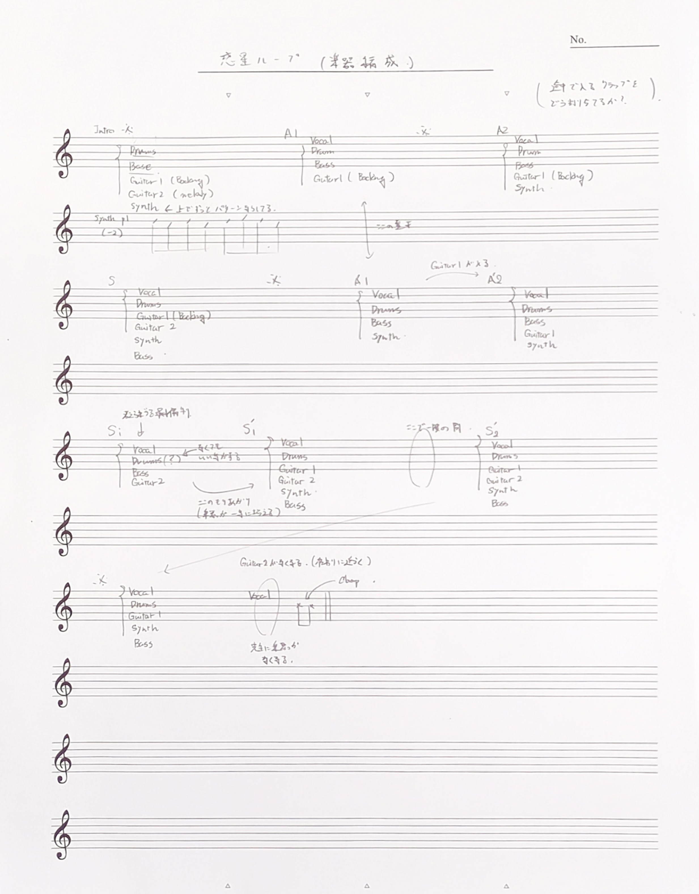
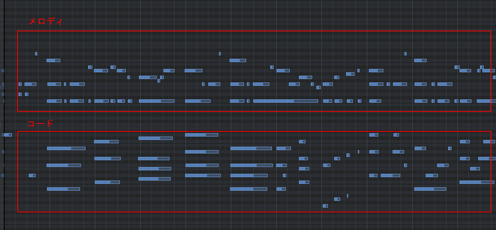
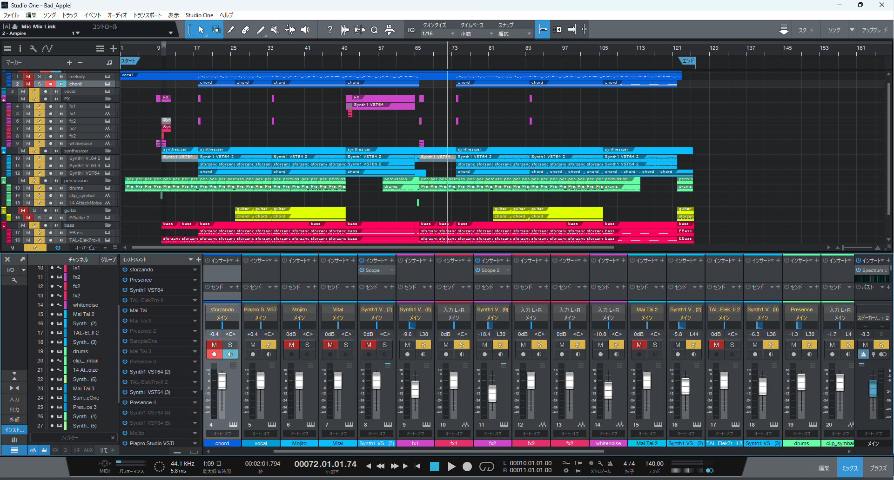
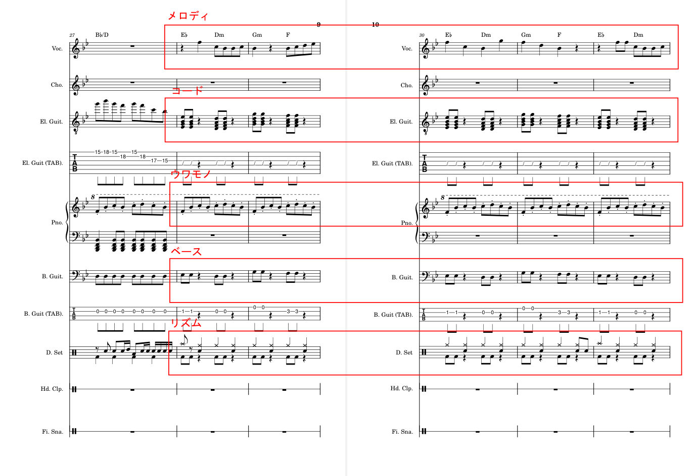
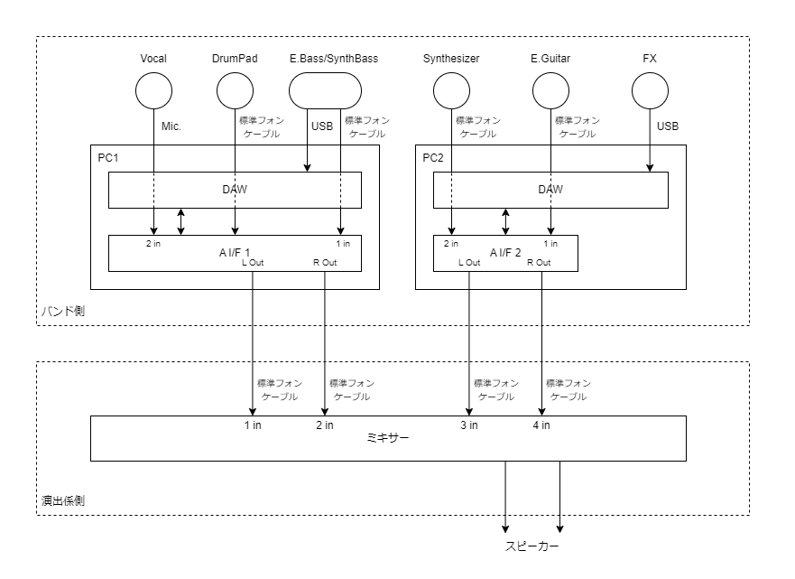

この記事は，「[長野高専 Advent Calender 2023](https://qiita.com/advent-calendar/2023/nnct)」15日目に合わせて書かれた記事です．こんにちは，やじるしです．毎年恒例，長野高専 Advent Calenderの季節がやってまいりました．
今回は，長野高専で10月に開催された工嶺祭の昼ステージで電子情報工学科5年の友達とバンドをしたときの話を書きたいと思います．特に，楽譜の作成と本番での楽器配線について書きます．
もしも今読んでいるあなたが，ライブをやってみたいけど，どうやればいいか分からないというような状態にあった場合やこれ活かせば音の表現の幅が広がるかもしれないと思った場合，この記事が参考になると幸いです．

## そもそもこのバンドは何なのか
このバンドの名前は[ここにバンド名を入力]です．バンドメンバーが作ったLineのグループ名がそのままバンド名になりました．工嶺祭のステージでバンドをするためにはじめは組まれた，電子情報工学科5年の5人ピースバンドです（文化祭時点）．
楽器編成は主にボーカル，エレキギター，ベース，キーボード，ドラムであり，僕はキーボードを担当しました．
できた経緯としては，ちょうど「ぼっち・ざ・ろっく！」が放送されていた時期に，文化祭でバンドをやったら面白そうみたいな話をベース担当のバンドメンバーと話していた次の日になぜか軽音楽部に入部していたことが始まりです．
（結束バンドにキーボードはいないって？）
ロックバンドだけではなく，テクノやEDMを文化祭でやってみたいという気持ちがバンド結成時にあり，これが選曲や楽器編成などに影響しています．

## 技術要素1. 採譜
1年前の12月くらいにできたバンドですが，練習を本格的に始めたのは8月末くらいです．カバーする楽曲は「惑星ループ」と「Bad Apple! feat nomico」（白黒のMVが有名なほう．東方原曲ではない）の2曲に決まっていたのですが，そのときには楽譜をどうするか決まっておらず，各々が自由にいろんな方法で練習していた状態でした．このまま本番に行くと演奏が破綻しかねないため，バンドでの統率をとるためには楽譜を作ることが必須事項だと考えました．ここでは，楽譜を作る過程での知見を書き残したいと思います．

### 手順
楽譜は次の手順で作りました．手順3に関しては順不同でどこから手を付けてもよいと思います．

#### 手順1. 音楽の構造を確認する
始めに，対象とする楽曲を聴いてどんな楽器で編成されているか，形式がどうなっているのかを紙などにメモをして
まとめておきます．一つの楽曲に対して大まかな構造が分かっていると次に行う作業の見通しが立ちやすくなります．
また，楽器の編成が分かっていると，どの楽器がどのような役割を持つとよいのかが分かります．
例えば，ロックバンドの場合の楽器編成はほとんどの場合「ボーカル」「リードギター」「バックギター」「ベース」「ドラム」（たまに「キーボード」）となりますが，「ボーカル」はメロディ，「リードギター」，「キーボード」はうわもの，「バックギター」，はコード，「ベース」がベース，「ベース」「ドラム」がリズムのようにそれぞれの楽器に音楽を構成する役割が与えられています．
以下の図が「惑星ループ」を採譜するにあたり初めにメモをしたものです．

#### 手順2. メロディおよびコードを聴き取る
現在のポップスは「リズム」「ベース」「コード」「メロディ」「うわもの」の5つが積み重なって構成されています．
この中の要素の2つである，コードとメロディを対象となる楽曲から聴き取っていきます．初めから手順1で得た楽器に割り当てる必要はなく，ギター + 歌もしくはキーボードのみなど自分が作業しやすい方法で聴き取りを行っていきます．ここでの目的は実際に楽譜を作ることではなく，コードとメロディ(+簡単なリズム)という楽曲の音楽的な構造を知ることです．

私はキーボードを用いて採譜前の聴き取りを行っています．使っているキーボードはYamahaのPSR-E344です．小学校の頃にクリスマスプレゼントとして買ってもらった練習用のキーボードですが（クリスマス要素），10年ほどだった現在でも現役で使っています（電源ボタンやその制御部分が壊れかけていて，電源を落とす方法がコードを抜くしかありませんが）．鍵盤の大きさや打鍵感は本物のピアノとは異なりますが，Touch Response機能もあり，打鍵速度に応じて音の大きさが変わるため，自分の手による打鍵で音量の調整ができるためとても良いです．

ピアノやキーボードが弾ける場合，右手でメロディを弾き，左手でコードを押さえるような奏法で，聴きとりながらキーボードで鍵盤を押さえていくとわかりやすいと思います．
また，電子キーボードや新しいシンセサイザーの場合，トランスポーズ機能を使うと簡単に聴き取れる場合があります．現在のポップスは調性音楽であることが多いです．
すなわち，一つのフレーズに対して基音とモード（使用する相対的な音列．メジャーやマイナーなど）が決まっており，ほとんど調性内の音のみでメロディやコードが構築されています．カラオケを想像するとわかりやすいのですが，歌いやすいキーに移動させる操作を良く行います．あれは，原曲が一つのキー（基音 + モード）が決まっており，そこからどれだけ音をずらすかという楽譜でいう縦軸の操作です．調性音楽の場合，キーをずらしたとしても音楽として破綻せず，演奏を行うことができます．機能上重要なのは使用するモードであり，基音はずらしたとしても音楽としては問題がないということです．
なので，キー（基音 + モード）さえ特定できてしまえば，あとはほとんどの場合そのキーで使用されている音の集合の中（いわゆる白鍵のどれか）から音を聴きとって選ぶということをすればよいのです．（ブルーノートなどキーから外れる音（いわゆる黒鍵の音）が出てくる場合があります．その音は調性から外れるため聴き取りやすいです．引っかかるような違和感，思ってもいなかった音が来たという感覚あると思います．）

しかし，キーボードのようなユーザーインターフェースの場合，コードは押さえやすいのですが，移調が行いにくいという欠点があります．音階の練習をしていないと，キーを特定したとしてもCメジャーかAマイナーしか弾けないということです．
解決方法としては，ハノンなどのピアノの教本を用いて移調の練習をするという方法がありますが，習得するにはかなり時間がかかります．私も鍵盤上を自由に移調できるようにしたいですが，ここでは電子キーボードやシンセサイザーによくついている機能であるトランスポーズを利用します．
トランスポーズは鍵盤の位置をそのままにして，音の位置を半音ずつずらすことができる機能です．
トランスポーズを使うことによって，鍵盤をそのままにして音の位置を半音ずつ移動させることが可能になるため，キーボードの移調が行いにくいという欠点を少しだけ減らすことができます．
そのため，まずは楽曲のキーを特定して，トランスポーズ機能を使ってそのキーが白鍵に来るように移調させてから作業を始めると，メロディとコードの聴き取りは行いやすいです．
トランスポーズの欠点は実際の鍵盤から鳴る音とは違う音が鳴るため人によっては違和感があることです．また，ライブなどで演奏をする場合もトランスポーズはあまり向いていません．とくに頻繁に移調を行う楽曲の場合（ジャズやアニソンなど）はトランスポーズを変更しないといけないということと，電子キーボードにしかない機能であるため，本物のピアノの場合はこの方法は通用しません．そのため，演奏者として柔軟に楽器達に対応するためには，日々の練習が必要不可欠です（自戒）．どちらの方法も取得することによって，作曲や音楽分析，演奏に役立てることができると思います．

様々な方法があると思いますが，キーボードとコンピュータをつなげられる場合は，DAWなどを使って録音をしておくと後でどんな感じで演奏したか確認しやすかったりします．
もしくは，紙にコードなどの情報をメモとして残しておくなどの方法もあると思います．

#### 手順3.1 メロディ，コードの各楽器への割り当て，（採譜の開始）
手順2で聞き取ったメロディ，コードを各楽器に割り当てて，楽譜を作り始めます．
楽譜を書く方法は手書きでも良いですが，今回は[MuseScore4](https://musescore.org/ja)を使って作りました．
楽譜作成のためのソフトウェアは有償で以下のようなものがあります．
- Finale（業界標準．めっちゃきれい + 楽譜上のほとんどの操作ができる，とても高い）
- Notion（Presouns製なので，Studio Oneと密な連携ができる）
- Sibelius（Avid製．UIがMSのOfficeっぽいイメージ）
- etc.

有償ではなく無償ででここまで楽譜を作れるのはすごいです．
楽譜の具体的な書き方や音楽の文法は「[楽典](https://www.ongakunotomo.co.jp/catalog/detail.php?id=100000)」にまとめられています．楽典を見ればどのように楽譜を書けばいいか分かるので手元にあるとよいと思います．

「惑星ループ」の場合，この時点で採譜を始めましたが，「Bad Apple!」は楽器の編成が特殊なため，DAWで一度完成形を作ってから採譜を始めました．
DAWはDigital Audio Workstationの略称で，オーディオやMIDI（コンピュータ上で音楽を扱うときの規格の一つ）の操作を全て行うことができる，情報処理工学でいうIDEのようなものです．

ここでは，Studio One Artistを使っています．ほかの会社からは次のようなものが販売されています．
- Cubase（日本のポップスの作曲家が使ってるイメージが強い）
- Ableton Live（日本海外問わずライブシーンでとても使われているイメージがある）
- Bitwig Studio（Ableton Liveから派生したDAW，CLAPという新しいプラグインの規格が使える）
- FL Studio（DAWの中では安い + バージョンアップ永久に無償．フレーズの扱い方が他に比べて独特）
- Digital Performer（日本だとsasakure.UKさんや坂本龍一さんが使っている．MIDIの分解能がものすごく高いため，リアルタイムで演奏する場合はよいかと）
- Avid Pro Tools（業界標準で使われているイメージ）
- Logic Pro（Macのみ，Macユーザーが作曲するときに使用しているイメージ）
- etc.

Studio OneはCubaseから派生したDAWで音が良いこと，オーディオファイルが扱いやすいことが特徴です．ほかのDAWに比べて直感的に扱いやすいと思っています．

Crypto Future MediaではVOCALOID用音源ライブラリである初音ミクなどにはVOCALOID音源に追加して，VOCALOID用のエディタ（Piapro Studio）とStudio One Artist，付属音源が付いてきます．これでなんと約20000円で買えます．
他のDAWは単体で買ったとしても20,000円から100,000円とかなり高いので，ミクさんなどクリプトンのキャラクターで作曲をしたい人はこれを買うだけで作曲環境が20,000円ですべて整うのでおすすめです．
もしもほかのDAWを使いたい場合は，各DAWは体験版を出していることが多いので，そこで使って自分に合ったものを探してみるのもよいと思います．それぞれのDAWには特徴があるので，それをつかんで，自分に合ってるか考えるのがおすすめです．

このDAWという存在は，かなり重要な役割を果たしています．またあとで出てきます．

#### 手順3.2 ベースとリズムを作る
ベースとドラムを打ち込んでいきます．ベースは基本的にはコードの基音となります．その音を基準として聴き取っていくとわかりやすいと思います．ドラムは打ち込みが難しく，うまくできなかったためドラム担当のバンドメンバーにたくさん修正してもらいました．（ほかの違和感があるところも修正してもらいました．ありがとうございます．）
ドラムにも五線譜上で表現をする記法があります．MuseScoreでは楽譜の打ち込みの際にどの音符がドラムのどの部分にあたるのかを示してくれるので分かりやすいです．
ただし，クローズハイハットとオープンハイハットは対応していないので，別途書き込みを行う必要があります．

#### 手順3.3 うわものを作る
残りのうわものを作っていきます．これは後ろで鳴っている装飾音やSE（サウンドエフェクト）のことです．
主にキーボードの右手で弾いていた部分や効果音として鳴らしていた部分になります．
後ろでなっているシーケンスパターンを聴き取って楽譜に落とし込むのですが，一つのパターンを楽節のなかで何度も繰り返している構造になっています．そのためパターンが急に変化するということは変な構造ではない限りはないと思います．
本番では，「Bad Apple!」のシーケンスパターンをずっと右手で鳴らしていた状態でしたが，このパターンを16分音符で一定間隔を保ちながら5分間弾き続けるのはさすがに無理があると思います．無理がない演奏にするために，他の方法を考えるべきです．

### 完成形
「惑星ループ」を例に完成した楽譜の一部を見てみます．

赤枠で囲った部分を見てみると，各楽器が役割に応じて音が並べられていることが分かります．
MuseScoreはギターやベースなど弾弦楽器の場合，TAB譜を自動的に作ってくれたり，五線譜に対応させることで，五線譜を変更するとタブ譜も変更されるなどの便利な機能が付いています．パソコンで楽譜を書くことと，手書きで楽譜を書くことはギャップは大きいですが
どちらにも利点があると思います．パソコンの場合は，修正が容易であること，コピーとペーストが行えることなどパソコンならではの利点があります．手書きの場合は，自分が思いついた音をペンですぐに楽譜上に書き込むことができるなどの利点があります．
自分のスタイルや状況に応じて使い分けるとよいと思います．

## 要素技術2. 本番時の楽器配線

### 当日の楽器等の問題点
楽譜問題は解決したので，これをもとに練習を行えば，ライブではしっかりと演奏ができるような基盤ができあがりました．

次に解決するべき問題点は楽器をどうするかです．「惑星ループ」はオリジナル自体がロックバンドの編成であるためこのままの編成で問題ないのですが，「Bad Apple!」をできる限りオリジナルに近づけて演奏をしようとする場合，ロックバンドの編成では不可能です．具体的には，ドラムがドラムパッドに変更，エレキベースがシンセベースに変更，シンセサイザーの音色の変更，効果音（FX）をどうするかというような問題点が挙げられます．

もう一つの問題点としては当日のスピーカーの制御権がバンド側にほぼないということです．
昼ステージは工嶺祭期間中に長野高専の中庭で行われます．音はステージの両側にある2台のスピーカーから出力され，これらのスピーカーはステージ袖にあるデジタルミキサーに接続されています．ステージ上にはバンドで使用するギターおよびベースのアンプとそのアンプ達の出力先にミキサーに接続されたマイク，そしてボーカル用のマイクが配置されています．
このような配置の場合，スピーカーから直接出される音のゲインやパンなどを制御できるのはデジタルミキサーを制御できる工嶺祭実行委員会の演出係もしくは軽音楽部長のみです．バンド側がデジタルミキサーに介入できるのは事前にデジタルミキサーにどのような接続を行ってほしいのか，デジタルミキサーの各パラメータはどのようにしたらよいのかを伝えることのみです．
また，当日は各団体の入れ替えおよび準備時間がかなり短く，ミキサーの調整を制御する係に伝えるような時間はあまりありません．
また，もともとほかのバンドで演奏をしていたバンドメンバーの情報によると，外だとボーカルやベースの音が聴こえなくなってしまうという現象が起きやすいという話や，ボーカルの音量が小さいときは自分の声帯で音量を調整しているという話が挙がりました．
以上のことから，バンド側が当日の状況に応じて柔軟にスピーカーから出力される音の調整を行うことは難しいことと，外という環境では音のバランスの調整が難しいということが分かりました．しかし，このまま十分な準備なしで演奏を行ってしまうと，ボーカルが全く聴こえない，ベースの音量が大きいなど，楽器間のバランスが破綻してしまうことを危惧しました．

これを解決するためには，バンド側でミキサーと同等の制御を柔軟に行えるような仕組みが必要になります．

### 解決手法

そこで，このバンドの楽器配線では楽器の音をそのままスピーカーに出力するのではなく，一度コンピュータを挟み，コンピュータに接続されたオーディオインタフェースからディジタルミキサーへ出力をするという方法を取りました．バンド演奏当日の楽器およびミキサーへの配線図を見てみます．

このバンドは，バンドメンバーの二人が持っているコンピュータとオーディオインターフェースおよびDAWが要になっています．
端的に言いますと，このバンドから出ている音（ディジタルミキサーに入力されている音）はすべてこの2台のコンピュータから出力された音になっています．

上の図を見るとわかりますが，全ての楽器はオーディオインターフェースによってオーディオ情報，USBを用いてMIDIがコンピュータ上にあるDAWに入力されています．全ての楽器をDAWを経由して音を出力することは次の利点があります．
- オーディオに対してエフェクトをかけることができる
- MIDIキーボードなどMIDIを出力できる機材の場合，楽器の変更ができる
- 本来ディジタルミキサーでしか操作できなかった音の音量，ゲインやパンまでも全てバンド側で柔軟に変更できるようなる．
- DAW上のプラグインを用いることで，様々な音やエフェクト，サンプラーなどの機能を使える，開発することができるといった拡張性がある．

ボーカルが毎回ステージだと音量が小さくなる場合があり，聴こえなくなるような場合には自分の声帯で音を大きくしている話や，外での演奏だとボーカルやベースが聴こえなくなるという現象が起こりやすいという話が練習中に挙がったため，初めはマイクを直接ディジタルミキサーにさすような編成にしていましたが，急遽これもコンピュータを経由するような配線にしました．これによりすべての楽器と声に対して音量のバランスが調整できるような配線を構築しました．
当日は「Bad Apple!」開始前に，バンド側が持つコンピュータ上のDAWで音量やイコライザーを操作して各楽器のバランスを取るような操作を行っていました．
また，FXはDAW付属のプラグインであるサンプラーを用いて各MIDI信号に対して音を割り当てて，MIDI信号をキーボードから送ることで，効果音をスピーカーから出力するような仕組みによって実現していました．

問題点としては，出力されている音がアンプや楽器本体から出るような生音ではないことです．アンプや生音系の楽器についてもプラグインでエミュレートした音，すなわちコンピュータ上で信号処理をした音が出力されるため
「本物のアンプの音や楽器本来の生音がいいんだ」という人にはお勧めできない方法です．今回のようなバンドの場合，テクノやEDMを演奏したかったということもあり，このような楽器の配線と相性が良かったのだと思います．

### 当日の問題点
本番前に，演奏前にどのように準備し，音のバランスの調整を行うのかという計画を立てていましたが，想定していた時間よりもかなり短くかつ，バンドと演出側での意思疎通が事前にうまくとれておらず，準備時間はバタバタしてしまいました．
そのため，そもそも音は出るのか，音のバランスは大丈夫なのだろうかという不安はありましたが，何とか音が出る状態となり演奏を開始することができました．

### ライブ終了後に感じた問題点
このような配線は音楽表現を行うにおいて，バンド側（演奏者側）の自由度と柔軟性が高い配線になっていると思います．
しかし問題点もあり，他のバンドに比べて機材の準備時間が必要なことです．また，マイクケーブルもバンド側で準備を行いたいなど演出側に対する要求が多くなってしまい，係側に迷惑をかけてしまったと思っています．
そのため，このような配線を用いてライブを行う場合は，どのような配線を行うのかなど，担当の係に十分に伝えること（工嶺祭でステージに出る場合は演出係に演出希望書を出すことになります．そこに事前に，演奏する楽曲の情報のほか，舞台上ではどのような配線にするのか，演出係にはどのようにしていただきたいのか，準備時間はどうするのかなど演出係が分かるように詳しく書いておくとスムーズにいくと思います．）と，昼ステージのような準備時間がかなり限られている場合は，バンド側で準備時間中にこれらの機材を配置するような準備を当日までに計画，できれば練習をしておくことが必要です．軽音楽部にはミキサーがあると思いますし，外部の練習室にはPAシステムが完備されている場所もありますので，本番前にそこで練習するのが良いと思います．

## 終わりに
高専に入り，「バンドリ」からアニメ文化を知り，ボカロを知り，「けいおん！」や「ぼざろ」を見きた中で僕は内心ではバンドやってみたいなという気持ちがあったのだと思います．でもまさか本当にバンドをするとは思っていませんでした．
バンドをほぼ全員やったことがない状態で，バンドやりたいという気持ちだけでここまで突き進み，8月中旬では，内心では楽譜も何もないこの状態で，本当に文化祭でできるのか？という不安な気持ちがありました．
9月の下旬から本格的に合奏を始めるというとてもスロースタートの状態の中で，本当に聴いてもらえるレベルで完成するのか？，本番の環境で機材はしっかり動くのか？という不安もありましたが，練習してる間はやっぱり合奏するのは楽しいと思いましたし，
進めていく中で，これならなんとかなりそうだという実感もありました．
この結果，文化祭当日に2曲とも完成した状態で演奏することができてとても楽しかったです．自分達が好きな音楽を一緒に演奏する，それを聴いている人たちに作り出した音楽を楽しんでもらうということはやっぱり楽しい，おもしろいことなのだと改めて実感しました．
最初はどうなることなのかと思いましたが，改めて思い返すとバンドやってよかったなと思っております．
このような場を与えてくださり，バンドメンバーの皆さんや，軽音楽部および演出係の皆さん，そして演奏を聴いていただいた皆さん，本当にありがとうございました．
